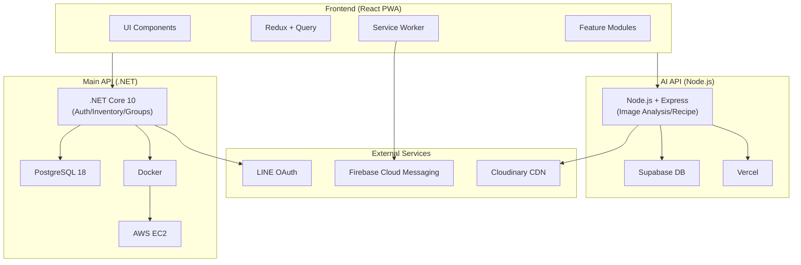

<p align="center">
  
  <h1 align="center" style="font-weight: 700">FuFood 冰箱庫存管理</h1>
</p>

<p align="center">
  <a href="https://fufood.jocelynh.me">🌐 Demo 網站</a> ｜
  <a href="https://www.figma.com/slides/jHSTBRXtUIvCTm41Mn7ucp/FuFood?node-id=0-1&p=f">📊 簡報介紹</a> ｜
  <a href="https://github.com/FuFoodTW/FuFoodAPI">🔧 後端 Repo</a> ｜
  <a href="https://github.com/BakaRickyClariS/gemini-ai-recipe-gen-mvp">🤖 AI 微服務 Repo</a>
</p>

<p align="center">
  <a href="https://api.fufood.jocelynh.me/swagger/index.html">📄 後端 API 文件</a> ｜
  <a href="https://gemini-ai-recipe-gen-mvp.vercel.app/docs-cdn/">📄 AI 微服務 API 文件</a> ｜
</p>

歡迎來到 FuFood！這是一款您的智慧冰箱管理助手，致力於解決食材過期與浪費問題，改善您的廚房生活品質。
透過 AI 影像辨識快速入庫、即時的到期提醒以及貼心的食譜推薦，FuFood 讓食材管理變得輕鬆簡單，不再煩惱「今晚煮什麼」。


---

## 📌 目錄

- [功能介紹](#-功能介紹)
- [功能亮點](#-功能亮點)
- [建議體驗流程](#-建議體驗流程)
- [前端技術](#-前端技術)
- [AI 微服務技術](#-ai-微服務技術)
- [後端技術](#️-後端技術)
- [系統架構](#️-系統架構)
- [專案結構](#-專案結構)
- [功能模組](#-功能模組)
- [快速開始](#-快速開始)
- [環境變數](#-環境變數)
- [開發規範](#-開發規範)
- [相關連結](#-相關連結)
- [授權](#-授權)

---

## 🕹️ 功能介紹

- **AI 影像辨識**：拍照自動識別食材種類與期限，支援多品項一次入庫。
- **智慧庫存管理**：紅綠燈顏色標示過期風險，清楚掌握冰箱狀態。
- **AI 食譜推薦**：根據現有庫存食材，AI 智慧生成料理建議。
- **群組共享協作**：邀請家人朋友加入冰箱群組，共同管理食材與購物清單。
- **App 推播通知**：食材過期前自動發送推播通知，避免浪費。
- **PWA 安裝體驗**：支援手機桌面安裝，提供接近原生 App 的流暢體驗。

---

## ✨ 功能亮點

| 功能                | 描述                                                |
| ------------------- | --------------------------------------------------- |
| 🤖 **AI 影像辨識**  | 支援單張/多張食材辨識，自動填寫名稱、分類、保存期限 |
| 🍳 **AI 食譜生成**  | 根據庫存食材自動推薦食譜，支援 Streaming 即時生成   |
| 📦 **智慧庫存管理** | 7 大分類、過期追蹤、低庫存警示、消耗紀錄            |
| 👨‍👩‍👧‍👦 **群組共享**     | 多人共用冰箱、成員權限管理、邀請碼加入              |
| 🛒 **共享購物清單** | 協作購物、貼文牆分享、圖片上傳                      |
| 🔔 **推播通知**     | Firebase Cloud Messaging 整合，食材到期/共享提醒    |
| 📱 **PWA 支援**     | 可安裝至桌面、離線快取、背景通知                    |
| 🔐 **LINE 登入**    | OAuth 2.0 整合、HttpOnly Cookie 安全認證            |

---

## 🏄 建議體驗流程

1.  **登入體驗**：使用 LINE 帳號一鍵登入，快速建立個人檔案。
2.  **建立冰箱**：新增一個冰箱群組，並分享邀請碼給同住家人。
3.  **食材入庫**：嘗試使用相機拍下剛買的食材，體驗 AI 自動辨識填寫資料。
4.  **查看庫存**：回到首頁查看剛剛入庫的食材，確認保存期限標示。
5.  **探索食譜**：點擊 AI 食譜功能，讓系統根據您的庫存推薦一道料理。
6.  **建立購物清單**：將缺少的食材加入購物清單，體驗協作採買功能。
7.  **消耗紀錄**：選擇使用掉的食材進行消耗，完成冰箱管理的最後一哩路。

---

## 🚀 快速開始

### 環境需求

- Node.js 18+
- npm / pnpm

### 安裝與執行

- 複製專案

```bash
git clone https://github.com/BakaRickyClariS/fufood.git
cd fufood
```

- 安裝依賴

```bash
npm install
```

- 複製環境變數

```bash
cp .env.example .env
```

- 開發環境

```bash
npm run dev
```

- 建置正式版

```bash
npm run build
```

- 產生 PWA 資源

```bash
npm run generate-pwa-assets
```

---

## 💻 前端技術

<a href="https://react.dev" target="_blank"></a>
<a href="https://www.typescriptlang.org" target="_blank"></a>
<a href="https://vitejs.dev" target="_blank"></a>
<a href="https://tailwindcss.com" target="_blank"></a>
<a href="https://redux-toolkit.js.org" target="_blank"></a>
<a href="https://tanstack.com/query" target="_blank"></a>
<a href="https://reactrouter.com" target="_blank"></a>
<a href="https://gsap.com" target="_blank"></a>
<a href="https://web.dev/progressive-web-apps" target="_blank"></a>
<a href="https://firebase.google.com" target="_blank"></a>
<a href="https://developers.line.biz" target="_blank"></a>
<a href="https://www.radix-ui.com" target="_blank"></a>
<a href="https://eslint.org" target="_blank"></a>
<a href="https://prettier.io" target="_blank"></a>

### 技術說明：

- **[ Vite ]**：
  - 使用 Vite 作為建置工具，提供快速的 HMR 熱更新與優化的生產建置。

- **[ React ]**：
  - 使用 React 進行前端開發，並運用最新的 Hooks、Suspense 等特性優化效能。

- **[ TypeScript ]**：
  - 採用 TypeScript 進行開發，透過嚴格的型別定義與編譯時期檢查，大幅減少製作時的型別錯誤。

- **[ Tailwind CSS + Radix UI ]**：
  - 使用 Tailwind CSS 進行原子化 CSS 開發，搭配 Radix UI 無障礙元件庫。

- **[ Redux Toolkit + TanStack Query ]**：
  - 採用雙軌狀態管理架構處理複雜的應用狀態：Redux 負責全域 UI 狀態（如 Modal、Toast），TanStack Query 則專注於資料快取與非同步請求。

- **[ GSAP ]**：
  - 使用 GSAP 為頁面注入生動的過場動畫與微互動。

- **[ Vite PWA Plugin + Workbox ]**：
  - 支援 PWA 安裝、離線快取、背景推播通知。

- **[ Vercel ]**：
  - 使用 Vercel 進行自動化部署，透過 GitHub Actions CI/CD 流程，實現快速迭代與持續交付。

---

## 🤖 AI 微服務技術

<a href="https://nodejs.org" target="_blank"></a>
<a href="https://expressjs.com" target="_blank"></a>
<a href="https://ai.google.dev" target="_blank"></a>
<a href="https://supabase.com" target="_blank"></a>
<a href="https://www.postgresql.org" target="_blank"></a>
<a href="https://firebase.google.com" target="_blank"></a>
<a href="https://cloudinary.com" target="_blank"></a>
<a href="https://swagger.io" target="_blank"></a>
<a href="https://vercel.com" target="_blank"></a>

### 技術說明：

- **[ Node.js + Express ]**：
  - 使用 Node.js 建構 AI 微服務，提供 RESTful API。

- **[ Google Gemini API ]**：
  - 整合 Google Gemini 2.0 Flash 進行食材影像辨識與食譜生成，支援多模態輸入（圖片+文字）。

- **[ Supabase (PostgreSQL) ]**：
  - 使用 Supabase 作為 BaaS 平台，提供 PostgreSQL 資料庫、即時訂閱、Row Level Security 等功能。

- **[ Firebase Cloud Messaging ]**：
  - 整合 FCM 進行跨平台推播通知，支援食材到期提醒、共享群組通知等場景。

- **[ Cloudinary ]**：
  - 使用 Cloudinary 進行圖片上傳、壓縮、CDN 快取，優化媒體資源載入效能。

- **[ Vercel Serverless ]**：
  - 使用 Vercel Serverless Functions 部署，提供全球 Edge Network 低延遲存取。

- **[ 🔒 資安架構 ]**：多層 AI 安全防護
  - **Prompt Validator**：攻擊詞過濾與注入檢測，防範 Prompt Injection
  - **Output Filter**：AI 回應內容檢查，過濾不當內容與拒絕回應處理
  - **Rate Limiting**：請求頻率限制，防止 DDoS 與濫用
  - **Multi API Key Fallback**：多組 API Key 輪替與自動切換，確保服務穩定性
  - **Security Logger**：可疑請求日誌紀錄，便於審計與異常追蹤

---

## 🏗️ 系統架構

此專案的系統架構：描述 Frontend (React PWA)、AI API (Node.js)、Main API (.NET) 與 External Services 之間的整體架構關係。



### 後端 API + AI 微服務

| API             | 核心功能                                                                   |
| --------------- | -------------------------------------------------------------------------- |
| **Backend API** | 認證管理、庫存 CRUD、群組共享、FCM 通知名單管理、食譜資料庫                |
| **AI API**      | 影像辨識 (Gemini 2.0)、食譜生成 (Streaming)、多 API Key 負載均衡、媒體上傳 |

---

## 📂 專案結構

```
fufood/
├── .github/workflows/          # GitHub Actions (CI/CD)
│   ├── auto-pr.yml             # 自動建立 PR
│   ├── auto-pr-select.yml      # 自動選擇合併
│   ├── deploy-prod.yml         # 正式環境部署
│   ├── release-branch.yml      # Release 分支管理
│   └── release-notify.yml      # Release 通知
├── docs/                       # 專案文件
│   ├── spec/                   # 規格與參考資料 (API 總表)
│   └── sdd/                    # 軟體設計文件 (Backend, Frontend, Features...)
├── src/
│   ├── api/                    # 共用 API 設定 (aiApi, backendApi)
│   ├── assets/                 # 靜態資源 (logos, icons, images)
│   ├── hooks/                  # 全域 Hooks
│   ├── lib/                    # 工具函式庫 (QueryClient, utils)
│   ├── modules/                # 功能模組 (核心業務邏輯)
│   │   ├── ai/                 # AI 查詢 Modal + 食譜生成
│   │   ├── auth/               # 認證 (LINE OAuth + 帳密)
│   │   ├── dashboard/          # 儀表板首頁
│   │   ├── food-scan/          # AI 食材辨識 (相機 + 上傳)
│   │   ├── groups/             # 群組管理 (成員 + 邀請)
│   │   ├── inventory/          # 庫存管理 (CRUD + 統計)
│   │   ├── media/              # 媒體上傳
│   │   ├── notifications/      # 通知中心 (FCM 整合)
│   │   ├── planning/           # 共享規劃 (購物清單 + 貼文牆)
│   │   ├── recipe/             # 食譜管理 (收藏 + 烹煮)
│   │   ├── settings/           # 設定頁 (個人資料 + 偏好)
│   │   └── shopping-lists/     # 購物清單
│   ├── routes/                 # 頁面路由
│   ├── shared/                 # 共用元件、hooks、layout
│   ├── store/                  # Redux Store
│   ├── styles/                 # 全域樣式
│   ├── utils/                  # 工具函式
│   ├── sw.ts                   # Service Worker (FCM + Workbox)
│   └── main.tsx                # 應用程式入口
├── types/                      # 全域型別定義
├── .env.example                # 環境變數範例
├── vite.config.ts              # Vite 設定
├── package.json
└── tsconfig.json
```

---

## 🧩 功能模組

### 核心模組一覽

| 模組              | 說明        | 主要功能                                             |
| ----------------- | ----------- | ---------------------------------------------------- |
| **auth**          | 使用者認證  | LINE OAuth、帳密登入、Token 管理、個人資料           |
| **inventory**     | 庫存管理    | 食材 CRUD、過期追蹤、分類檢視、消耗紀錄、低庫存警示  |
| **food-scan**     | AI 食材辨識 | 相機拍照、影像上傳、AI 分析（單品/多品項）、批次入庫 |
| **ai**            | AI 查詢     | 食譜靈感生成（Streaming）、食材篩選、Prompt 安全檢查 |
| **recipe**        | 食譜管理    | 瀏覽、收藏、烹煮確認、餐期計畫                       |
| **groups**        | 群組管理    | 群組 CRUD、成員管理、邀請流程、權限控制              |
| **dashboard**     | 儀表板      | 庫存摘要、推薦食譜、AI 入口、快速操作                |
| **planning**      | 共享規劃    | 購物清單、貼文牆、協作編輯、圖片上傳                 |
| **notifications** | 通知中心    | 食材提醒、系統通知、批次操作、FCM 推播               |
| **settings**      | 設定        | 個人檔案、飲食偏好、推播設定、會員方案               |
| **media**         | 媒體上傳    | Cloudinary 整合、圖片壓縮、上傳進度                  |

> 每個模組皆有獨立規格書，詳見 `src/modules/{module}/spec.md`

### 模組架構

每個功能模組遵循統一結構：

```
{module}/
├── api/          # API 層 (queries.ts, mutations.ts)
├── components/   # UI 元件 (features/, ui/, layout/, modals/)
├── hooks/        # 自定義 Hooks
├── services/     # 服務層 (API 實作, Mock)
├── store/        # Redux Slice
├── types/        # TypeScript 型別
├── constants/    # 常數定義
├── utils/        # 模組工具函式
├── contexts/     # Context Provider (選用)
├── providers/    # Provider 元件 (選用)
└── spec.md       # 模組規格書
```

---

## 📋 開發規範

詳細的 Git Flow、Commit 規範、CI/CD 流程與 Gemini Code Assist 使用方式，請參閱 [開發規格文件](./docs/spec/development-guidelines.md)。

## 📄 授權

此專案採用 [MIT License](./LICENSE)。

---
