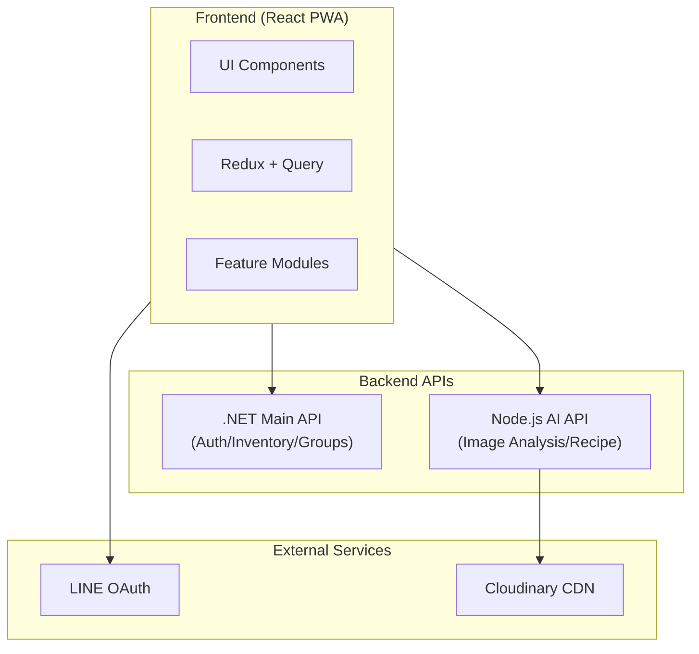

# FuFood 智慧食材管理系統（前端）

一個以 **React 19 + TypeScript + Vite** 建構的智慧食材管理 PWA 應用，透過 AI 影像辨識技術自動識別食材、追蹤庫存與到期日，並整合 LINE 登入與通知，提供個人化食譜推薦。

---

## 🧭 專案簡介

FuFood 是一款智慧冰箱管理 App，核心功能包括：

- **AI 食材辨識**：拍照自動識別食材並入庫
- **庫存追蹤**：管理食材數量、過期日、低庫存提醒
- **智慧推薦**：根據現有食材推薦食譜
- **群組共享**：家庭/團隊共享冰箱管理
- **共享規劃**：協作購物清單與貼文牆

採用**雙 API 架構**（後端 API + AI 微服務），支援 LINE OAuth 登入與 PWA 安裝。

---

## 🔹 技術棧

| 項目 | 技術 | 說明 |
| --- | --- | --- |
| **主框架** | React 19 + TypeScript + Vite 7 | 高效 SPA 架構 |
| **樣式系統** | Tailwind CSS 4 + Radix UI | 原子化 CSS + 無障礙元件 |
| **狀態管理** | Redux Toolkit + TanStack Query | 客戶端/伺服器狀態分離 |
| **表單驗證** | React Hook Form | 表單狀態管理 |
| **路由** | React Router v7 | 宣告式路由 |
| **動畫** | GSAP | 流暢 UI 動畫 |
| **API 通訊** | Fetch + HttpOnly Cookie | 安全認證 |
| **登入系統** | LINE OAuth 2.0 | 社群登入 |
| **拖放功能** | dnd-kit | 拖拉排序 |
| **PWA** | Vite PWA Plugin + Workbox | 離線支援、可安裝 |
| **AI Review** | Gemini Code Assist | 自動 Code Review |

---

## 🏗️ 系統架構



### 雙 API 架構

| API | 用途 | 環境變數 |
| --- | --- | --- |
| **Backend API** | 認證、庫存、群組、通知 | `VITE_BACKEND_API_BASE_URL` |
| **AI API** | 影像辨識、食譜生成、媒體上傳 | `VITE_AI_API_BASE_URL` |

---

## 📂 專案結構

```
fufood/
├── .github/workflows/          # GitHub Actions (CI/CD)
├── docs/                       # 專案文件
│   ├── api/                    # API 規格
│   ├── backend/                # 後端 API 文件
│   └── features/               # 功能規劃文件
├── src/
│   ├── api/                    # 共用 API 設定
│   ├── assets/                 # 靜態資源
│   ├── lib/                    # 工具函式庫 (QueryClient, utils)
│   ├── modules/                # 功能模組 (核心業務邏輯)
│   │   ├── ai/                 # AI 查詢 Modal
│   │   ├── auth/               # 認證 (LINE OAuth + 帳密)
│   │   ├── dashboard/          # 儀表板首頁
│   │   ├── food-scan/          # AI 食材辨識
│   │   ├── groups/             # 群組管理
│   │   ├── inventory/          # 庫存管理
│   │   ├── media/              # 媒體上傳
│   │   ├── notifications/      # 通知中心
│   │   ├── planning/           # 共享規劃
│   │   ├── recipe/             # 食譜管理
│   │   ├── settings/           # 設定頁
│   │   └── shopping-lists/     # 購物清單
│   ├── routes/                 # 頁面路由
│   ├── shared/                 # 共用元件、hooks、layout
│   ├── store/                  # Redux Store
│   ├── styles/                 # 全域樣式
│   └── utils/                  # 工具函式
├── types/                      # 全域型別定義
├── .env.example                # 環境變數範例
└── package.json
```

---

## 🧩 功能模組

### 核心模組一覽

| 模組 | 說明 | 主要功能 |
| --- | --- | --- |
| **auth** | 使用者認證 | LINE OAuth、帳密登入、Token 管理 |
| **inventory** | 庫存管理 | 食材 CRUD、過期追蹤、分類檢視、消耗紀錄 |
| **food-scan** | AI 食材辨識 | 相機拍照、影像上傳、AI 分析、批次入庫 |
| **recipe** | 食譜管理 | 瀏覽、收藏、烹煮、餐期計畫 |
| **groups** | 群組管理 | 群組 CRUD、成員管理、邀請流程 |
| **dashboard** | 儀表板 | 庫存摘要、推薦食譜、AI 入口 |
| **planning** | 共享規劃 | 購物清單、貼文牆、協作編輯 |
| **notifications** | 通知中心 | 食材提醒、系統通知、批次操作 |
| **settings** | 設定 | 個人檔案、飲食偏好、會員方案 |

> 每個模組皆有獨立 README，詳見 `src/modules/{module}/README.md`

### 模組架構

每個功能模組遵循統一結構：

```
{module}/
├── api/          # API 層 (queries.ts, mutations.ts)
├── components/   # UI 元件 (features/, ui/, layout/)
├── hooks/        # 自定義 Hooks
├── services/     # 服務層
├── store/        # Redux Slice
├── types/        # TypeScript 型別
├── constants/    # 常數定義
├── utils/        # 模組工具函式
└── README.md     # 模組說明文件
```

---

## 🚀 快速開始

### 環境需求

- Node.js 18+
- npm / pnpm

### 安裝與執行

```bash
# 安裝依賴
npm install

# 開發環境
npm run dev

# 建置正式版
npm run build

# 預覽建置結果
npm run preview

# ESLint 檢查
npm run lint

# 自動修正
npm run lint:fix
```

### 環境變數

複製 `.env.example` 為 `.env` 並填入設定：

```bash
# API 設定
VITE_BACKEND_API_BASE_URL=https://api.fufood.jocelynh.me
VITE_AI_API_BASE_URL=https://ai-api.vercel.app/api/v1

# LINE 登入
VITE_LINE_CLIENT_ID=your_line_channel_id
VITE_LINE_REDIRECT_URI=http://localhost:5173/auth/line/callback

# 開發模式
VITE_USE_MOCK_API=false
```

---

## 🌱 Git Flow 規範

### 主分支

| 分支 | 用途 | 部署環境 |
| --- | --- | --- |
| **main** | 正式版本 | 生產環境 |
| **qa** | 測試版本 | Vercel 預覽 |
| **dev** | 開發整合 | 本地開發 |

### 功能分支

| 分支前綴 | 用途 | 命名範例 |
| --- | --- | --- |
| `Feature-` | 新功能開發 | `Feature-ai-scan` |
| `Fix-` | 錯誤修正 | `Fix-login-bug` |
| `Update-` | 文件/設定更新 | `Update-readme` |
| `Hotfix-` | 緊急修正 | `Hotfix-api-error` |

---

## 📝 Commit 規範

| 前綴 | 用途 |
| --- | --- |
| `feat:` | 新增功能 |
| `fix:` | 修正 bug |
| `style:` | 樣式調整 |
| `docs:` | 文件更新 |
| `refactor:` | 重構程式碼 |
| `chore:` | 設定檔、依賴更新 |

**範例：**

```bash
feat: 新增 AI 多品項辨識功能
fix: 修正庫存過期計算錯誤
docs: 更新 inventory 模組 README
```

---

## 📊 開發流程圖

```
【開發階段】
├─ 從 dev 建立功能分支
│  └─ Feature-xxx / Fix-xxx
├─ 開發並提交 commit
│  └─ git push origin Feature-xxx

【QA 測試】
├─ 直接 merge 進 qa 分支
├─ QA 團隊測試
│  └─ 使用 /gemini review 進行 AI Code Review

【整合發佈】
├─ 觸發 Auto PR to Dev 工作流
├─ Code Review 後 merge 至 dev
├─ 觸發 Create Release Branch
│  └─ 自動更新版本號與 CHANGELOG
├─ 最終 merge 至 main
└─ ✅ 部署上線
```

---

## 🤖 Gemini Code Assist

整合 Gemini Code Assist 進行自動化 AI Code Review：

### 使用方式

在 PR 評論中使用指令：

| 指令 | 說明 |
| --- | --- |
| `/gemini summary` | 產生 PR 變更摘要 |
| `/gemini review` | 詳細程式碼審查 |
| `/gemini help` | 查看所有指令 |

### 設定檔

專案根目錄 `.gemini-code-review.json` 定義審查規則。

---

## 🔗 相關連結

- **後端 API 文件**: `docs/backend/`
- **Gemini Code Assist**: https://developers.google.com/gemini-code-assist
- **Vite 官方文件**: https://vitejs.dev/
- **React 官方文件**: https://react.dev/
- **TanStack Query**: https://tanstack.com/query
- **Tailwind CSS**: https://tailwindcss.com/

---

## 📄 授權

此專案採用 MIT License。

---

**最後更新**: 2025-12-29  
**版本**: v0.2.0  
**狀態**: 開發中 🚀
