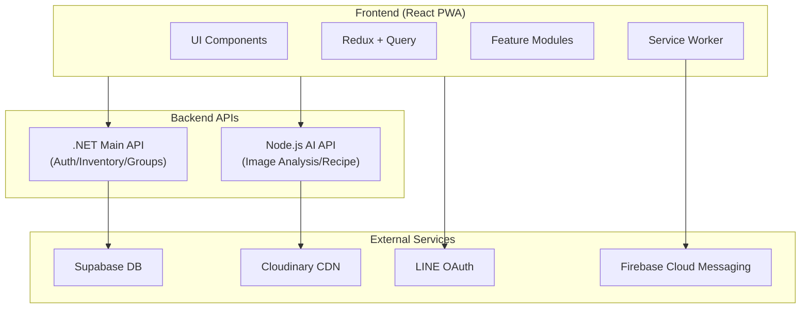

<p align="center">
  
  <h1 align="center" style="font-weight: 700">FuFood 冰箱庫存管理</h1>
</p>

<p align="center">
  <a href="https://fufood.jocelynh.me">🌐 Demo 網站</a> ｜
  <a href="https://www.figma.com/slides/jHSTBRXtUIvCTm41Mn7ucp/FuFood?node-id=0-1&p=f">📊 簡報介紹</a> ｜
  <a href="https://github.com/FuFoodTW/FuFoodAPI">🔧 後端 Repo</a> ｜
  <a href="https://github.com/BakaRickyClariS/gemini-ai-recipe-gen-mvp">🤖 AI 微服務 Repo</a>
</p>

<p align="center">
  <a href="https://api.fufood.jocelynh.me/swagger/index.html">📄 後端 API 文件</a> ｜
  <a href="https://gemini-ai-recipe-gen-mvp.vercel.app/docs-cdn/">📄 AI 微服務 API 文件</a> ｜
</p>

一個以 **React 19 + TypeScript + Vite 7** 建構的智慧食材管理 PWA 應用，透過 AI 影像辨識技術自動識別食材、追蹤庫存與到期日，並整合 LINE 登入與 FCM 推播通知，提供個人化食譜推薦。


---

## 📌 目錄

- [專案簡介](#-專案簡介)
- [功能亮點](#-功能亮點)
- [前端技術](#-前端技術)
- [後端技術](#️-後端技術)
- [系統架構](#️-系統架構)
- [專案結構](#-專案結構)
- [功能模組](#-功能模組)
- [快速開始](#-快速開始)
- [環境變數](#-環境變數)
- [Git Flow 規範](#-git-flow-規範)
- [Commit 規範](#-commit-規範)
- [開發流程圖](#-開發流程圖)
- [CI/CD 流程](#-cicd-流程)
- [Gemini Code Assist](#-gemini-code-assist)
- [相關連結](#-相關連結)
- [授權](#-授權)

---

## 🧭 專案簡介

FuFood 是一款智慧冰箱管理 App，核心功能包括：

- **AI 食材辨識**：拍照自動識別食材並入庫，支援單品項/多品項辨識
- **庫存追蹤**：管理食材數量、過期日、低庫存提醒
- **智慧推薦**：AI 根據現有食材推薦食譜，支援 Streaming 生成
- **群組共享**：家庭/團隊共享冰箱管理
- **共享規劃**：協作購物清單與貼文牆
- **FCM 推播通知**：食材到期提醒、共享清單通知

採用 **雙 API 架構**（後端 API + AI 微服務），支援 LINE OAuth 登入與 PWA 安裝。

---

## ✨ 功能亮點

| 功能                | 描述                                                |
| ------------------- | --------------------------------------------------- |
| 🤖 **AI 影像辨識**  | 支援單張/多張食材辨識，自動填寫名稱、分類、保存期限 |
| 🍳 **AI 食譜生成**  | 根據庫存食材自動推薦食譜，支援 Streaming 即時生成   |
| 📦 **智慧庫存管理** | 7 大分類、過期追蹤、低庫存警示、消耗紀錄            |
| 👨‍👩‍👧‍👦 **群組共享**     | 多人共用冰箱、成員權限管理、邀請碼加入              |
| 🛒 **共享購物清單** | 協作購物、貼文牆分享、圖片上傳                      |
| 🔔 **推播通知**     | Firebase Cloud Messaging 整合，食材到期/共享提醒    |
| 📱 **PWA 支援**     | 可安裝至桌面、離線快取、背景通知                    |
| 🔐 **LINE 登入**    | OAuth 2.0 整合、HttpOnly Cookie 安全認證            |

---

## 💻 前端技術


### 技術說明：

- **[ 環境 ]**：Vite 7
  - 使用 Vite 作為建置工具，提供快速的 HMR 熱更新與優化的生產建置，開發體驗極佳。

- **[ 框架 ]**：React 19
  - 使用 React 19 進行前端開發，透過 React 生態系快速開發高品質 Web 應用，並運用最新的 Hooks、Suspense 等特性優化效能與開發體驗。

- **[ 語言 ]**：TypeScript
  - 使用 TypeScript 進行開發，透過嚴格的型別檢查，減少協作時產生的錯誤，提升程式碼可維護性。

- **[ 樣式 ]**：Tailwind CSS 4 + Radix UI
  - 使用 Tailwind CSS 4 進行原子化 CSS 開發，搭配 Radix UI 無障礙元件庫，快速建構一致且可存取的使用者介面。

- **[ 狀態管理 ]**：Redux Toolkit + TanStack Query
  - 採用客戶端/伺服器狀態分離架構，Redux 管理 UI 狀態，TanStack Query 處理伺服器狀態與快取。

- **[ 動畫 ]**：GSAP
  - 使用 GSAP 打造流暢的 UI 動畫效果，提升使用者互動體驗。

- **[ PWA ]**：Vite PWA Plugin + Workbox
  - 支援 PWA 安裝、離線快取、背景推播通知，提供原生 App 般的使用體驗。

- **[ 部署平台 ]**：Vercel
  - 使用 Vercel 進行自動化部署，透過 GitHub Actions CI/CD 流程，實現快速迭代與持續交付。

---

## ⌨️ 後端技術


### 技術說明：

- **[ 主 API ]**：ASP.NET Core Web API
  - 使用 .NET 8 建構主要後端 API，處理認證、庫存管理、群組管理、通知推播等核心功能。

- **[ AI 微服務 ]**：Node.js + Express
  - 使用 Node.js 建構 AI 微服務，整合 Google Gemini API 進行食材影像辨識與食譜生成，支援 Streaming 即時回應。

- **[ 資料庫 ]**：Supabase (PostgreSQL)
  - 使用 Supabase 作為 BaaS 平台，提供 PostgreSQL 資料庫、即時訂閱、Row Level Security 等功能。

- **[ 媒體存儲 ]**：Cloudinary
  - 使用 Cloudinary 進行圖片上傳、壓縮、CDN 快取，優化媒體資源載入效能。

- **[ 推播服務 ]**：Firebase Cloud Messaging
  - 整合 FCM 進行跨平台推播通知，支援食材到期提醒、共享群組通知等場景。

---

## 🏗️ 系統架構



### 雙 API 架構

| API             | 用途                             | 環境變數                    |
| --------------- | -------------------------------- | --------------------------- |
| **Backend API** | 認證、庫存、群組、通知、食譜儲存 | `VITE_BACKEND_API_BASE_URL` |
| **AI API**      | 影像辨識、食譜生成、媒體上傳     | `VITE_AI_API_BASE_URL`      |

---

## 📂 專案結構

```
fufood/
├── .github/workflows/          # GitHub Actions (CI/CD)
│   ├── auto-pr.yml             # 自動建立 PR
│   ├── auto-pr-select.yml      # 自動選擇合併
│   ├── deploy-prod.yml         # 正式環境部署
│   ├── release-branch.yml      # Release 分支管理
│   └── release-notify.yml      # Release 通知
├── docs/                       # 專案文件
│   ├── api/                    # API 規格
│   ├── backend/                # 後端 API 文件
│   ├── features/               # 功能規劃文件
│   ├── fixes/                  # 問題修復紀錄
│   ├── optimizations/          # 優化文件
│   └── refactor/               # 重構文件
├── src/
│   ├── api/                    # 共用 API 設定 (aiApi, backendApi)
│   ├── assets/                 # 靜態資源 (logos, icons, images)
│   ├── hooks/                  # 全域 Hooks
│   ├── lib/                    # 工具函式庫 (QueryClient, utils)
│   ├── modules/                # 功能模組 (核心業務邏輯)
│   │   ├── ai/                 # AI 查詢 Modal + 食譜生成
│   │   ├── auth/               # 認證 (LINE OAuth + 帳密)
│   │   ├── dashboard/          # 儀表板首頁
│   │   ├── food-scan/          # AI 食材辨識 (相機 + 上傳)
│   │   ├── groups/             # 群組管理 (成員 + 邀請)
│   │   ├── inventory/          # 庫存管理 (CRUD + 統計)
│   │   ├── media/              # 媒體上傳
│   │   ├── notifications/      # 通知中心 (FCM 整合)
│   │   ├── planning/           # 共享規劃 (購物清單 + 貼文牆)
│   │   ├── recipe/             # 食譜管理 (收藏 + 烹煮)
│   │   ├── settings/           # 設定頁 (個人資料 + 偏好)
│   │   └── shopping-lists/     # 購物清單
│   ├── routes/                 # 頁面路由
│   ├── shared/                 # 共用元件、hooks、layout
│   ├── store/                  # Redux Store
│   ├── styles/                 # 全域樣式
│   ├── utils/                  # 工具函式
│   ├── sw.ts                   # Service Worker (FCM + Workbox)
│   └── main.tsx                # 應用程式入口
├── types/                      # 全域型別定義
├── .env.example                # 環境變數範例
├── vite.config.ts              # Vite 設定
├── package.json
└── tsconfig.json
```

---

## 🧩 功能模組

### 核心模組一覽

| 模組              | 說明        | 主要功能                                             |
| ----------------- | ----------- | ---------------------------------------------------- |
| **auth**          | 使用者認證  | LINE OAuth、帳密登入、Token 管理、個人資料           |
| **inventory**     | 庫存管理    | 食材 CRUD、過期追蹤、分類檢視、消耗紀錄、低庫存警示  |
| **food-scan**     | AI 食材辨識 | 相機拍照、影像上傳、AI 分析（單品/多品項）、批次入庫 |
| **ai**            | AI 查詢     | 食譜靈感生成（Streaming）、食材篩選、Prompt 安全檢查 |
| **recipe**        | 食譜管理    | 瀏覽、收藏、烹煮確認、餐期計畫                       |
| **groups**        | 群組管理    | 群組 CRUD、成員管理、邀請流程、權限控制              |
| **dashboard**     | 儀表板      | 庫存摘要、推薦食譜、AI 入口、快速操作                |
| **planning**      | 共享規劃    | 購物清單、貼文牆、協作編輯、圖片上傳                 |
| **notifications** | 通知中心    | 食材提醒、系統通知、批次操作、FCM 推播               |
| **settings**      | 設定        | 個人檔案、飲食偏好、推播設定、會員方案               |
| **media**         | 媒體上傳    | Cloudinary 整合、圖片壓縮、上傳進度                  |

> 每個模組皆有獨立 README，詳見 `src/modules/{module}/README.md`

### 模組架構

每個功能模組遵循統一結構：

```
{module}/
├── api/          # API 層 (queries.ts, mutations.ts)
├── components/   # UI 元件 (features/, ui/, layout/, modals/)
├── hooks/        # 自定義 Hooks
├── services/     # 服務層 (API 實作, Mock)
├── store/        # Redux Slice
├── types/        # TypeScript 型別
├── constants/    # 常數定義
├── utils/        # 模組工具函式
├── contexts/     # Context Provider (選用)
├── providers/    # Provider 元件 (選用)
└── README.md     # 模組說明文件
```

---

## 🚀 快速開始

### 環境需求

- Node.js 18+
- npm / pnpm

### 安裝與執行

```bash
# 複製專案
git clone https://github.com/your-username/fufood.git
cd fufood

# 安裝依賴
npm install

# 複製環境變數
cp .env.example .env

# 開發環境
npm run dev

# 建置正式版
npm run build

# 預覽建置結果
npm run preview

# ESLint 檢查
npm run lint

# 自動修正
npm run lint:fix

# 產生 PWA 資源
npm run generate-pwa-assets
```

---

## 🔧 環境變數

複製 `.env.example` 為 `.env` 並填入設定：

```bash
# API 設定
VITE_BACKEND_API_BASE_URL=https://api.fufood.jocelynh.me
VITE_AI_API_BASE_URL=https://ai-api.vercel.app/api/v1

# Cloudinary（媒體上傳）
VITE_CLOUDINARY_CLOUD_NAME=your_cloud_name
VITE_CLOUDINARY_UPLOAD_PRESET=your_preset

# LINE 登入
VITE_LINE_LOGIN_MODE=auto  # popup | redirect | auto

# Firebase (FCM 推播)
VITE_FIREBASE_API_KEY=your_api_key
VITE_FIREBASE_AUTH_DOMAIN=your_auth_domain
VITE_FIREBASE_PROJECT_ID=your_project_id
VITE_FIREBASE_STORAGE_BUCKET=your_storage_bucket
VITE_FIREBASE_MESSAGING_SENDER_ID=your_sender_id
VITE_FIREBASE_APP_ID=your_app_id
VITE_FIREBASE_VAPID_KEY=your_vapid_key

# 開發模式
VITE_USE_MOCK_API=false
```

### 環境變數說明

| 變數                        | 必要 | 說明                              |
| --------------------------- | ---- | --------------------------------- |
| `VITE_BACKEND_API_BASE_URL` | ✅   | 後端 API 網址（認證、庫存、群組） |
| `VITE_AI_API_BASE_URL`      | ✅   | AI API 網址（影像辨識、食譜生成） |
| `VITE_CLOUDINARY_*`         | ⚠️   | 媒體上傳（可選，Mock 模式不需要） |
| `VITE_LINE_LOGIN_MODE`      | ❌   | LINE 登入模式，預設 `auto`        |
| `VITE_FIREBASE_*`           | ⚠️   | FCM 推播通知（可選）              |
| `VITE_USE_MOCK_API`         | ❌   | 啟用 Mock API，預設 `false`       |

---

## 🌱 Git Flow 規範

### 主分支

| 分支     | 用途     | 部署環境    |
| -------- | -------- | ----------- |
| **main** | 正式版本 | 生產環境    |
| **qa**   | 測試版本 | Vercel 預覽 |
| **dev**  | 開發整合 | 本地開發    |

### 功能分支

| 分支前綴   | 用途          | 命名範例           |
| ---------- | ------------- | ------------------ |
| `Feature-` | 新功能開發    | `Feature-ai-scan`  |
| `Fix-`     | 錯誤修正      | `Fix-login-bug`    |
| `Update-`  | 文件/設定更新 | `Update-readme`    |
| `Hotfix-`  | 緊急修正      | `Hotfix-api-error` |

---

## 📝 Commit 規範

| 前綴        | 用途             |
| ----------- | ---------------- |
| `feat:`     | 新增功能         |
| `fix:`      | 修正 bug         |
| `style:`    | 樣式調整         |
| `docs:`     | 文件更新         |
| `refactor:` | 重構程式碼       |
| `chore:`    | 設定檔、依賴更新 |
| `perf:`     | 效能優化         |
| `test:`     | 測試相關         |

**範例：**

```bash
feat: 新增 AI 多品項辨識功能
fix: 修正庫存過期計算錯誤
docs: 更新 inventory 模組 README
refactor: 重構通知模組 API 呼叫
```

---

## 📊 開發流程圖

```
【開發階段】
├─ 從 dev 建立功能分支
│  └─ Feature-xxx / Fix-xxx
├─ 開發並提交 commit
│  └─ git push origin Feature-xxx

【QA 測試】
├─ 直接 merge 進 qa 分支
├─ QA 團隊測試
│  └─ 使用 /gemini review 進行 AI Code Review

【整合發佈】
├─ 觸發 Auto PR to Dev 工作流
├─ Code Review 後 merge 至 dev
├─ 觸發 Create Release Branch
│  └─ 自動更新版本號與 CHANGELOG
├─ 最終 merge 至 main
└─ ✅ 部署上線
```

---

## 🔄 CI/CD 流程

專案使用 GitHub Actions 進行自動化 CI/CD：

| 工作流程             | 觸發條件        | 說明                          |
| -------------------- | --------------- | ----------------------------- |
| `auto-pr.yml`        | Push 到功能分支 | 自動建立 PR 至目標分支        |
| `auto-pr-select.yml` | PR 合併         | 選擇性觸發後續流程            |
| `release-branch.yml` | dev 分支更新    | 建立 Release 分支並更新版本號 |
| `release-notify.yml` | Release 發布    | 發送通知至 Slack/Discord      |
| `deploy-prod.yml`    | PR 合併至 main  | 部署至生產環境                |

---

## 🤖 Gemini Code Assist

整合 Gemini Code Assist 進行自動化 AI Code Review：

### 使用方式

在 PR 評論中使用指令：

| 指令              | 說明             |
| ----------------- | ---------------- |
| `/gemini summary` | 產生 PR 變更摘要 |
| `/gemini review`  | 詳細程式碼審查   |
| `/gemini help`    | 查看所有指令     |

### 設定檔

專案根目錄 `.gemini-code-review.json` 定義審查規則。

---

## 🔗 相關連結

- **後端 API 文件**: `docs/backend/`
- **功能規劃文件**: `docs/features/`
- **Gemini Code Assist**: https://developers.google.com/gemini-code-assist
- **Vite 官方文件**: https://vitejs.dev/
- **React 官方文件**: https://react.dev/
- **TanStack Query**: https://tanstack.com/query
- **Tailwind CSS**: https://tailwindcss.com/
- **Radix UI**: https://www.radix-ui.com/
- **Redux Toolkit**: https://redux-toolkit.js.org/
- **Firebase Cloud Messaging**: https://firebase.google.com/docs/cloud-messaging

---

## 📄 授權

此專案採用 MIT License。

---

**最後更新**: 2026-01-26  
**版本**: v0.3.0  
**狀態**: 開發中 🚀
