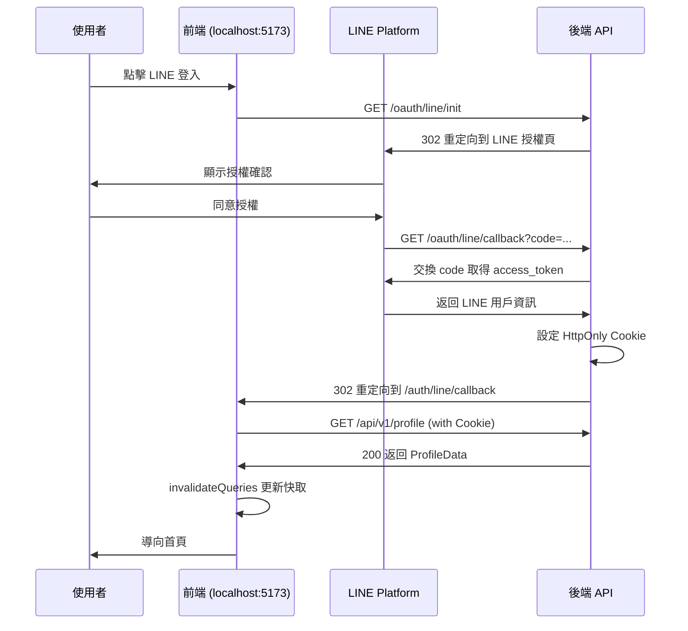

# Auth Module API Specification

**版本**: v1.1  
**最後更新**: 2025-12-16  
**文件用途**: 提供後端介接與確認路由/回應格式  
**涵蓋範圍**: Auth 模組（註冊、登入、Token、LINE OAuth、HttpOnly Cookie 認證、個資更新）

---

## 1. 基本規範

### 1.1 認證方式

- **HttpOnly Cookie**（推薦）：後端設定 `httpOnly`、`Secure`、`SameSite=Lax` Cookie
- Access Token 以 `Authorization: Bearer <access_token>` 攜帶（亦可搭配 Cookie）
- Refresh Token 建議以 `httpOnly` Cookie 儲存

### 1.2 Base URL

```
後端 API: https://api.fufood.jocelynh.me
路由前綴: /api/v1
LINE OAuth: /oauth/line
```

### 1.3 標準回應與錯誤格式

- 成功：`200/201/204`，依情境回應物件或空內容。
- 失敗：

```json
{
  "code": "ERROR_CODE",
  "message": "錯誤訊息",
  "details": {},
  "timestamp": "2025-12-08T10:00:00Z"
}
```

---

## 2. 資料模型

### 2.1 User

```typescript
type MembershipTier = 'free' | 'premium' | 'vip';

type User = {
  id: string;
  email?: string;           // LINE 登入可能無 email
  name?: string;
  avatar: string;
  createdAt: Date;
  // LINE 專屬欄位
  lineId?: string;
  displayName?: string;
  pictureUrl?: string;      // LINE 頭貼 URL
  // 會員等級
  membershipTier?: MembershipTier;
};
```

### 2.2 AuthToken

```typescript
type AuthToken = {
  accessToken: string;
  refreshToken?: string;
  expiresIn: number; // seconds
};
```

### 2.3 ProfileData（Profile API 回應）

```typescript
type ProfileData = {
  id: string;
  lineId: string;
  name: string;
  profilePictureUrl: string;
};

type ProfileResponse = {
  data: ProfileData;
};
```

---

## 3. Auth API

### 3.1 註冊

- **POST** `/api/v1/auth/register`
- Body: `{ email, password, name?, avatar? }`
- 201 → `{ user: User, token: AuthToken }`

### 3.2 登入

- **POST** `/api/v1/auth/login`
- Body: `{ email, password }`
- 200 → `{ user: User, token: AuthToken }`

### 3.3 登出

- **POST** `/api/v1/auth/logout`
- 204 或 `{ success: true }`，同時清除 Cookie。

### 3.4 刷新 Token

- **POST** `/api/v1/auth/refresh`
- Body: `{ refreshToken: string }`（亦可由 httpOnly Cookie 取得）
- 200 → `{ accessToken, expiresIn }`

### 3.5 取得目前使用者

- **GET** `/api/v1/auth/me`
- 200 → `User`

### 3.6 檢查 Token

- **GET** `/api/v1/auth/check`
- 204 或 `{ success: true }`（需攜帶 Access Token）

### 3.7 LINE 登入導向

- **GET** `/oauth/line/init`
- 302 → LINE 授權頁 URL

### 3.8 LINE 登入回呼

- **GET** `/oauth/line/callback?code=...&state=...`
- 後端處理：
  1. 驗證 code 並取得 LINE 用戶資訊
  2. 設定 HttpOnly Cookie（access_token）
  3. 302 重定向到前端 `/auth/line/callback`

### 3.9 取得用戶 Profile（HttpOnly Cookie 認證）

- **GET** `/api/v1/profile`
- Headers: 無需手動設定（瀏覽器自動攜帶 Cookie）
- Request: `credentials: 'include'`
- 200 → `{ data: ProfileData }`
- 401 → 未登入

**重要**：此 API 用於前端驗證登入狀態，TanStack Query 會快取結果。

```typescript
// 前端呼叫範例
const response = await fetch(`${LINE_API_BASE}/api/v1/profile`, {
  credentials: 'include', // 攜帶 HttpOnly Cookie
});
```

### 3.10 更新個人資料

- **PUT** `/api/v1/auth/update-profile`
- Body: `{ name?, avatar? }`
- 200 → `User`

### 3.11 前端 Mock 登入 (開發用)

- **純前端實作**，無後端路由。
- 模擬電子郵件登入流程，直接產生 Mock Token。

---

## 4. LINE OAuth 流程



---

## 5. Cookie 設定規範

後端設定 Cookie 時應使用以下配置：

```
Set-Cookie: access_token=<token>; 
  HttpOnly; 
  Secure; 
  SameSite=Lax; 
  Path=/; 
  Max-Age=604800
```

| 屬性 | 值 | 說明 |
|------|-----|------|
| `HttpOnly` | true | 防止 XSS 攻擊 |
| `Secure` | true | 僅 HTTPS 傳輸 |
| `SameSite` | Lax | 防止 CSRF，允許導航請求 |
| `Path` | / | 全站有效 |
| `Max-Age` | 604800 | 7 天有效期 |

---

## 6. 錯誤碼示例

| code | 說明 |
|------|------|
| AUTH_001 | Email 已存在 |
| AUTH_002 | 認證失敗（帳密錯誤或 Token 無效） |
| AUTH_003 | Refresh Token 無效或過期 |
| AUTH_004 | LINE OAuth 失敗 |
| AUTH_005 | Cookie 未設定或已過期 |

---

## 7. 前端整合注意事項

### 7.1 TanStack Query 配置

```typescript
export function useGetUserProfileQuery() {
  return useQuery({
    queryKey: ['GET_USER_PROFILE'],
    queryFn: getUserProfile,
    retry: false,                 // 401 時不重試
    staleTime: 1000 * 60 * 5,     // 5 分鐘快取
    refetchOnWindowFocus: false,
  });
}
```

### 7.2 跨域請求

前端請求需設定 `credentials: 'include'` 以攜帶 Cookie：

```typescript
fetch(url, { credentials: 'include' });
```

後端需設定 CORS：

```
Access-Control-Allow-Origin: https://fufood.vercel.app
Access-Control-Allow-Credentials: true
```

### 7.3 登入狀態更新

登入成功後使用 `queryClient.invalidateQueries` 更新快取：

```typescript
await queryClient.invalidateQueries({ queryKey: ['GET_USER_PROFILE'] });
```
