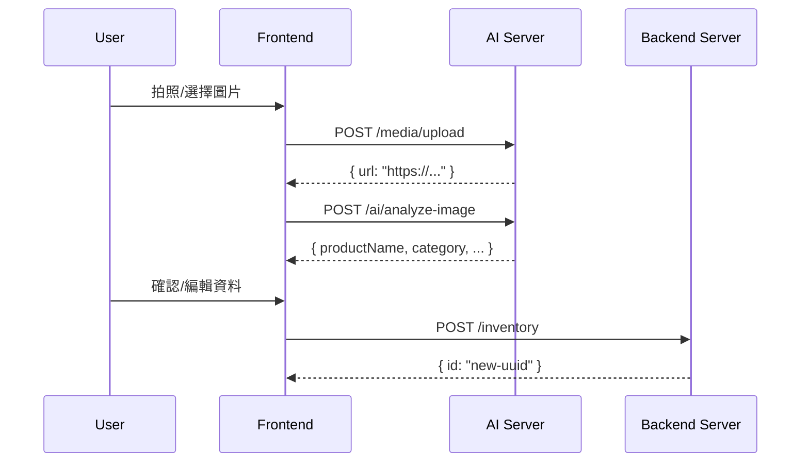

# 入庫流程完整 API 規格

**版本**: v3.0  
**最後更新**: 2025-12-19  
**前端分支**: `Feature-connect-and-sort-ai-api`

> [!IMPORTANT]
> 本文件整合「AI 影像辨識」與「庫存管理」的完整入庫流程 API 規格。
> AI 服務使用 `VITE_AI_API_BASE_URL`，庫存服務使用 `VITE_BACKEND_API_BASE_URL`。

---

## 快速索引

- [API 架構](#api-架構)
- [入庫流程概覽](#入庫流程概覽)
- [Step 1: 媒體上傳](#step-1-媒體上傳)
- [Step 2: AI 影像辨識](#step-2-ai-影像辨識)
- [Step 3: 提交至庫存](#step-3-提交至庫存)
- [庫存管理 API](#庫存管理-api)
- [型別定義](#型別定義)
- [錯誤處理](#錯誤處理)

---

## API 架構

### 雙 API 架構

| API 類型 | 環境變數 | 用途 | Base URL |
|----------|----------|------|----------|
| **AI API** | `VITE_AI_API_BASE_URL` | 媒體上傳、影像辨識 | `/api/v1` |
| **Backend API** | `VITE_BACKEND_API_BASE_URL` | 庫存管理 CRUD | `https://api.fufood.jocelynh.me` |

### 認證方式

- **Access Token**: Header `Authorization: Bearer <access_token>`
- **HttpOnly Cookie**: 自動攜帶 (credentials: 'include')

---

## 入庫流程概覽



### 三步驟流程

| 步驟 | API Server | 端點 | 說明 |
|:----:|------------|------|------|
| 1 | AI | `POST /media/upload` | 上傳圖片至 Cloudinary |
| 2 | AI | `POST /ai/analyze-image` | AI 辨識食材資訊 |
| 3 | Backend | `POST /inventory` | 提交至庫存系統 |

---

## Step 1: 媒體上傳

### 端點

```
POST /api/v1/media/upload
Host: VITE_AI_API_BASE_URL
Content-Type: multipart/form-data
```

### 請求

| 欄位 | 類型 | 必填 | 說明 |
|------|------|:----:|------|
| `file` | File/Blob | ✅ | 圖片檔案 |

### 成功回應 (200)

```json
{
  "success": true,
  "data": {
    "url": "https://res.cloudinary.com/xxx/image/upload/v123/fufood/abc.jpg",
    "publicId": "fufood/abc"
  }
}
```

### 錯誤回應

| 代碼 | HTTP | 說明 |
|------|:----:|------|
| `MEDIA_001` | 400 | 未提供檔案 |
| `MEDIA_002` | 400 | 檔案類型不支援 |
| `MEDIA_003` | 413 | 檔案過大 (>10MB) |
| `MEDIA_005` | 500 | Cloudinary 上傳失敗 |

---

## Step 2: AI 影像辨識

### 端點

```
POST /api/v1/ai/analyze-image
Host: VITE_AI_API_BASE_URL
Content-Type: application/json
```

### 請求

```json
{
  "imageUrl": "https://res.cloudinary.com/xxx/image/upload/v123/fufood/abc.jpg"
}
```

### 成功回應 (200)

```json
{
  "success": true,
  "data": {
    "productName": "蘋果",
    "category": "水果",
    "attributes": "常溫",
    "purchaseQuantity": 3,
    "unit": "顆",
    "purchaseDate": "2025-12-19",
    "expiryDate": "2025-12-26",
    "lowStockAlert": true,
    "lowStockThreshold": 2,
    "notes": "",
    "imageUrl": "https://res.cloudinary.com/xxx/image/upload/..."
  },
  "timestamp": "2025-12-19T10:00:00Z"
}
```

### 回應欄位說明

| 欄位 | 類型 | 說明 |
|------|------|------|
| `productName` | string | 食材名稱 |
| `category` | FoodCategory | 食材分類 |
| `attributes` | FoodAttribute | 保存方式 (常溫/冷藏/冷凍) |
| `purchaseQuantity` | number | 數量 |
| `unit` | FoodUnit | 單位 |
| `purchaseDate` | string | 購買日期 (YYYY-MM-DD) |
| `expiryDate` | string | 保存期限 (YYYY-MM-DD) |
| `lowStockAlert` | boolean | 是否啟用低庫存提醒 |
| `lowStockThreshold` | number | 低庫存門檻 |
| `notes` | string | 備註 |
| `imageUrl` | string | 圖片 URL |

### 錯誤回應

| 代碼 | HTTP | 說明 |
|------|:----:|------|
| `AI_001` | 400 | 缺少 imageUrl |
| `AI_005` | 500 | AI 服務暫時無法使用 |
| `AI_006` | 504 | AI 處理逾時 |

---

## Step 3: 提交至庫存

### 端點

```
POST /api/v1/inventory
Host: VITE_BACKEND_API_BASE_URL
Content-Type: application/json
Authorization: Bearer <access_token>
```

### 請求 (FoodItemInput)

```json
{
  "productName": "蘋果",
  "category": "水果",
  "attributes": "常溫",
  "purchaseQuantity": 3,
  "unit": "顆",
  "purchaseDate": "2025-12-19",
  "expiryDate": "2025-12-26",
  "lowStockAlert": true,
  "lowStockThreshold": 2,
  "notes": "有機蘋果",
  "imageUrl": "https://res.cloudinary.com/..."
}
```

### 成功回應 (201)

```json
{
  "status": true,
  "message": "Created successfully",
  "data": {
    "id": "550e8400-e29b-41d4-a716-446655440000"
  }
}
```

### 錯誤回應

| 代碼 | HTTP | 說明 |
|------|:----:|------|
| `INV_001` | 400 | 缺少必要欄位 |
| `INV_002` | 400 | 日期格式錯誤 |
| `INV_003` | 401 | 未授權 |

---

## 庫存管理 API

> 所有庫存 API 使用 **Backend API** (`VITE_BACKEND_API_BASE_URL`)

### 路由總表

| Method | Path | 功能 | 備註 |
|--------|------|------|------|
| GET | `/api/v1/inventory` | 取得庫存列表 | 支援 status, include 參數 |
| GET | `/api/v1/inventory/{id}` | 取得單一食材 | |
| POST | `/api/v1/inventory` | 新增食材 | 入庫使用 |
| PUT | `/api/v1/inventory/{id}` | 更新食材 | |
| DELETE | `/api/v1/inventory/{id}` | 刪除食材 | |
| DELETE | `/api/v1/inventory/batch` | 批次刪除 | 可選 |
| GET | `/api/v1/inventory/categories` | 分類列表 | |
| GET | `/api/v1/inventory/summary` | 庫存摘要 | 或用 include=summary |
| GET | `/api/v1/inventory/settings` | 取得設定 | |
| PUT | `/api/v1/inventory/settings` | 更新設定 | |

### 取得庫存列表

```
GET /api/v1/inventory?status=expiring-soon&include=summary,stats&limit=20
```

**Query 參數**:

| 參數 | 類型 | 說明 |
|------|------|------|
| `groupId` | string | 群組 ID |
| `category` | string | 分類篩選 |
| `status` | string | `expired`, `expiring-soon`, `low-stock`, `frequent`, `normal` |
| `include` | string | `summary`, `stats` (逗號分隔) |
| `page` | number | 分頁 |
| `limit` | number | 每頁數量 |

**回應**:

```json
{
  "status": true,
  "data": {
    "items": [/* FoodItem[] */],
    "total": 100,
    "stats": {
      "totalItems": 100,
      "expiredCount": 5,
      "expiringSoonCount": 12,
      "lowStockCount": 8,
      "byCategory": { "蔬菜": 20, "水果": 15, ... }
    },
    "summary": {
      "total": 100,
      "expiring": 12,
      "expired": 5,
      "lowStock": 8
    }
  }
}
```

---

## 型別定義

### 通用封裝格式

```typescript
// 成功回應封裝
type ApiSuccess<T> = {
  status: true;
  message?: string;
  data: T;
};
```

### FoodCategory (食材分類)

```typescript
type FoodCategory =
  | '蔬菜'
  | '水果'
  | '肉類'
  | '海鮮'
  | '乳製品'
  | '飲品'
  | '零食'
  | '調味料'
  | '其他';
```

### FoodAttribute (保存方式)

```typescript
type FoodAttribute = '常溫' | '冷藏' | '冷凍';
```

### FoodUnit (單位)

```typescript
type FoodUnit =
  | '個' | '包' | '瓶' | '罐' | '盒'
  | 'kg' | 'g' | 'L' | 'ml' | '顆';
```

### FoodItemInput (入庫請求 - 來自 AI 辨識)

```typescript
// 用於 AI 辨識結果 -> 提交庫存
type FoodItemInput = {
  productName: string;
  category: FoodCategory;
  attributes: FoodAttribute;
  purchaseQuantity: number;
  unit: FoodUnit;
  purchaseDate: string;     // YYYY-MM-DD
  expiryDate: string;       // YYYY-MM-DD
  lowStockAlert: boolean;
  lowStockThreshold: number;
  notes: string;
  imageUrl?: string;
};
```

### FoodItem (庫存項目 - 後端回傳)

```typescript
// 後端儲存的完整食材資料
type FoodItem = {
  id: string;
  name: string;
  category: FoodCategory;
  quantity: number;
  unit: FoodUnit;
  imageUrl?: string;
  purchaseDate: string;     // YYYY-MM-DD
  expiryDate: string;       // YYYY-MM-DD
  lowStockAlert: boolean;
  lowStockThreshold: number;
  notes?: string;
  groupId?: string;
  createdAt: string;        // ISO 8601
  updatedAt?: string;       // ISO 8601
  attributes?: string[];    // e.g. ['葉菜類', '有機']
};
```

### GetInventoryRequest (取得庫存請求)

```typescript
type GetInventoryRequest = {
  groupId?: string;
  category?: FoodCategory;
  status?: InventoryStatus;   // 'expired' | 'expiring-soon' | 'low-stock' | 'frequent' | 'normal'
  include?: string;           // 'summary' | 'stats' | 'summary,stats'
  page?: number;
  limit?: number;
};
```

### AddFoodItemRequest (新增食材請求)

```typescript
type AddFoodItemRequest = Omit<FoodItem, 'id' | 'createdAt' | 'updatedAt'>;
```

### InventoryStats (庫存統計)

```typescript
type InventoryStats = {
  totalItems: number;
  expiredCount: number;
  expiringSoonCount: number;
  lowStockCount: number;
  byCategory: Record<FoodCategory, number>;
};
```

### InventorySummary (庫存摘要)

```typescript
type InventorySummary = {
  total: number;
  expiring: number;
  expired: number;
  lowStock: number;
};
```

### InventorySettings (庫存設定)

```typescript
type InventorySettings = {
  lowStockThreshold: number;
  expiringSoonDays: number;
  notifyOnExpiry: boolean;
  notifyOnLowStock: boolean;
  layoutType?: 'layout-a' | 'layout-b' | 'layout-c';
  categoryOrder?: string[];
};
```

### CategoryInfo (分類資訊)

```typescript
type CategoryInfo = {
  id: string;
  title: string;
  count: number;
  imageUrl: string;
  bgColor: string;
  slogan: string;
  description: string[];
};
```

### Food (食材主檔)

```typescript
// 食材基本資料（非庫存）
type Food = {
  id: string;
  name: string;
  category: string;
  defaultUnit: string;
  imageUrl?: string;
  nutritionInfo?: Record<string, unknown>;
};
```

---


## 錯誤處理

### 統一錯誤格式

```json
{
  "code": "ERROR_CODE",
  "message": "錯誤描述",
  "details": {
    "field": "錯誤欄位",
    "issue": "原因"
  },
  "timestamp": "2025-12-19T10:00:00Z"
}
```

### 錯誤代碼總表

| 代碼 | HTTP | 模組 | 說明 |
|------|:----:|------|------|
| `MEDIA_001` | 400 | Media | 未提供檔案 |
| `MEDIA_002` | 400 | Media | 不支援的檔案類型 |
| `MEDIA_003` | 413 | Media | 檔案過大 |
| `MEDIA_005` | 500 | Media | 上傳失敗 |
| `AI_001` | 400 | AI | 缺少必要參數 |
| `AI_005` | 500 | AI | AI 服務錯誤 |
| `AI_006` | 504 | AI | AI 處理逾時 |
| `INV_001` | 400 | Inventory | 缺少必要欄位 |
| `INV_002` | 400 | Inventory | 資料格式錯誤 |
| `INV_003` | 401 | Inventory | 未授權 |
| `INV_004` | 404 | Inventory | 找不到資源 |

---

## 環境變數

### AI 後端

```bash
CLOUDINARY_CLOUD_NAME=your_cloud_name
CLOUDINARY_API_KEY=your_api_key
CLOUDINARY_API_SECRET=your_api_secret
GEMINI_API_KEY=your_gemini_key
```

### 主後端

```bash
DATABASE_URL=your_database_url
JWT_SECRET=your_jwt_secret
```

### 前端

```bash
VITE_AI_API_BASE_URL=https://your-ai-api.vercel.app/api/v1
VITE_BACKEND_API_BASE_URL=https://api.fufood.jocelynh.me
VITE_USE_MOCK_API=false
```

---

## 相關檔案

| 檔案 | 說明 |
|------|------|
| [mediaApi.ts](file:///d:/User/Ricky/HexSchool/finalProject/fufood/src/modules/media/api/mediaApi.ts) | 媒體上傳 API |
| [imageRecognition.ts](file:///d:/User/Ricky/HexSchool/finalProject/fufood/src/modules/food-scan/services/api/imageRecognition.ts) | AI 辨識 + 庫存操作 |
| [inventoryApiImpl.ts](file:///d:/User/Ricky/HexSchool/finalProject/fufood/src/modules/inventory/api/inventoryApiImpl.ts) | 庫存管理 API |
| [useImageUpload.ts](file:///d:/User/Ricky/HexSchool/finalProject/fufood/src/modules/food-scan/hooks/useImageUpload.ts) | 圖片上傳 Hook |

---

## 變更歷史

| 日期 | 版本 | 說明 |
|------|------|------|
| 2025-12-19 | v3.0 | 整合入庫流程，區分 AI/Backend API |
| 2025-12-13 | v2.3 | 新增 status/include 參數 |
