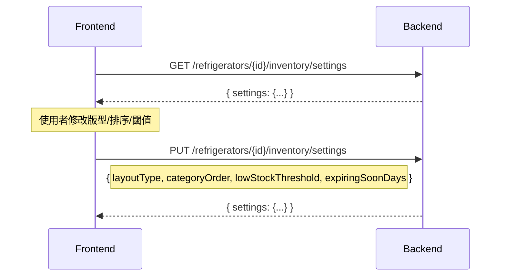

# Inventory Settings API 規格文件

**版本**: v1.0  
**日期**: 2025-12-30  
**用途**: 提供給後端開發者實作庫存設定相關 API

---

## 1. 概述

Settings 頁面需要以下 API 來支援庫存設定功能：
1. **取得設定** - 讀取使用者的庫存設定（版型、排序、提醒閾值）
2. **更新設定** - 儲存使用者修改後的設定
3. **取得分類列表** - Fallback 用，當設定中無分類資料時使用

---

## 2. Base Path

```
/api/v1/refrigerators/{refrigeratorId}/inventory
```

### Headers（所有請求必須）
| Header | 值 | 說明 |
|--------|---|------|
| `Content-Type` | `application/json` | |
| `X-User-Id` | `<userId>` | 使用者識別碼 |
| `Authorization` | `Bearer <token>` | 若有 |

---

## 3. API 端點

### 3.1 取得庫存設定

**GET** `/settings`

#### Request
無 Body

#### Response (200 OK)
```typescript
{
  status: true,
  data: {
    settings: {
      // 版型設定
      layoutType: "layout-a" | "layout-b" | "layout-c",
      
      // 分類排序（ID 陣列）
      categoryOrder: ["fruit", "frozen", "bake", "milk", "seafood", "meat", "others"],
      
      // 提醒閾值
      lowStockThreshold: number,      // 低庫存警示數量（預設 2）
      expiringSoonDays: number,       // 即將過期判定天數（預設 3）
      
      // 通知開關（可選）
      notifyOnExpiry?: boolean,
      notifyOnLowStock?: boolean,
      
      // 分類詳細設定（可選，用於自訂標題/顯示）
      categories?: CategorySettingItem[]
    }
  }
}
```

#### CategorySettingItem 結構
```typescript
type CategorySettingItem = {
  id: string;           // "fruit", "frozen", etc.
  title: string;        // "蔬果類", "冷凍調理類", etc.
  isVisible: boolean;   // 是否顯示於庫存頁
  subCategories?: string[];  // 子分類標籤
}
```

---

### 3.2 更新庫存設定

**PUT** `/settings`

#### Request Body
```typescript
{
  // 以下欄位皆為可選，只傳要更新的欄位
  layoutType?: "layout-a" | "layout-b" | "layout-c",
  categoryOrder?: string[],
  lowStockThreshold?: number,
  expiringSoonDays?: number,
  notifyOnExpiry?: boolean,
  notifyOnLowStock?: boolean,
  categories?: CategorySettingItem[]
}
```

#### 前端實際發送範例
```json
{
  "layoutType": "layout-b",
  "categoryOrder": ["frozen", "fruit", "meat", "bake", "seafood", "milk", "others"],
  "lowStockThreshold": 3,
  "expiringSoonDays": 5
}
```

#### Response (200 OK)
```typescript
{
  status: true,
  message: "Settings updated successfully",
  data: {
    settings: InventorySettings  // 回傳更新後的完整設定
  }
}
```

---

### 3.3 取得分類列表（Fallback 用）

**GET** `/categories`

> 此 API 用於當 `GET /settings` 的 `categories` 欄位為空時作為 fallback

#### Response (200 OK)
```typescript
{
  status: true,
  data: {
    categories: [
      {
        id: "fruit",
        title: "蔬果類",
        count: 15,           // 該分類下的食材數量
        imageUrl: "https://...",
        bgColor: "#E8F5E9",
        slogan: "新鮮蔬果",
        description: ["葉菜類", "根莖類", "水果類"]
      },
      // ... 其他分類
    ]
  }
}
```

---

## 4. 資料模型

### 4.1 InventorySettings
```typescript
type InventorySettings = {
  lowStockThreshold: number;      // 預設 2
  expiringSoonDays: number;       // 預設 3
  notifyOnExpiry: boolean;        // 預設 true
  notifyOnLowStock: boolean;      // 預設 true
  layoutType?: "layout-a" | "layout-b" | "layout-c";  // 預設 "layout-a"
  categoryOrder?: string[];       // 預設 ["fruit", "frozen", "bake", "milk", "seafood", "meat", "others"]
  categories?: CategorySettingItem[];
}
```

### 4.2 CategoryInfo（GET /categories 回應用）
```typescript
type CategoryInfo = {
  id: string;
  title: string;
  count: number;
  imageUrl: string;
  bgColor: string;
  slogan: string;
  description: string[];
}
```

### 4.3 FoodCategory（有效的分類 ID）
```typescript
type FoodCategory = 
  | "fruit"     // 蔬果類
  | "frozen"    // 冷凍調理類
  | "bake"      // 主食烘焙類
  | "milk"      // 乳品飲料類
  | "seafood"   // 冷凍海鮮類
  | "meat"      // 肉品類
  | "others";   // 其他
```

---

## 5. 錯誤處理

| 狀態碼 | 情境 | 回應範例 |
|--------|------|---------|
| 400 | 無效的 layoutType | `{ code: "INVALID_LAYOUT", message: "Invalid layout type" }` |
| 401 | 缺少 X-User-Id | `{ code: "UNAUTHORIZED", message: "User ID required" }` |
| 404 | refrigeratorId 不存在 | `{ code: "NOT_FOUND", message: "Refrigerator not found" }` |
| 500 | 伺服器錯誤 | `{ code: "INTERNAL_ERROR", message: "..." }` |

---

## 6. 前端使用流程



---

## 7. 資料庫建議 Schema

```sql
CREATE TABLE inventory_settings (
  id UUID PRIMARY KEY DEFAULT gen_random_uuid(),
  refrigerator_id UUID NOT NULL REFERENCES refrigerators(id),
  user_id TEXT NOT NULL,
  
  -- 版型
  layout_type VARCHAR(20) DEFAULT 'layout-a',
  
  -- 分類排序（JSON 陣列）
  category_order JSONB DEFAULT '["fruit","frozen","bake","milk","seafood","meat","others"]',
  
  -- 提醒閾值
  low_stock_threshold INTEGER DEFAULT 2,
  expiring_soon_days INTEGER DEFAULT 3,
  notify_on_expiry BOOLEAN DEFAULT true,
  notify_on_low_stock BOOLEAN DEFAULT true,
  
  -- 分類自訂設定（可選）
  categories JSONB,
  
  created_at TIMESTAMPTZ DEFAULT NOW(),
  updated_at TIMESTAMPTZ DEFAULT NOW(),
  
  UNIQUE(refrigerator_id, user_id)
);
```

---

## 8. 前端程式碼參考

相關檔案：
- `src/modules/inventory/components/layout/SettingsPanel.tsx`
- `src/modules/inventory/api/inventoryApiImpl.ts`
- `src/modules/inventory/types/api.types.ts`
