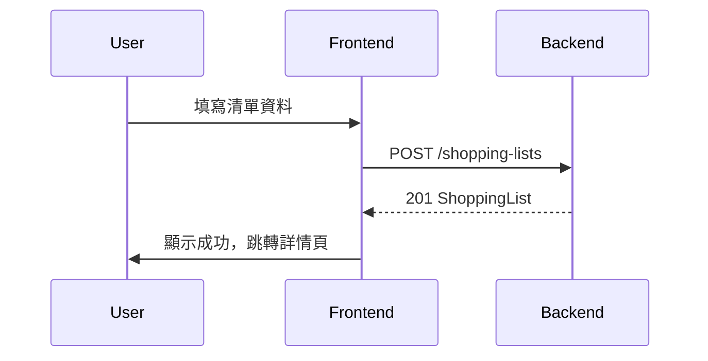
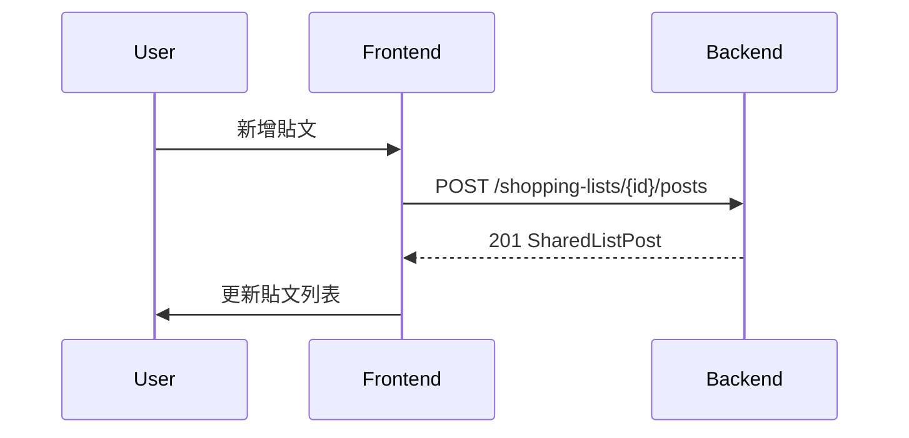

# Shopping Lists Module API Specification

**版本**: v1.1  
**最後更新**: 2025-12-28  
**涵蓋範圍**: 購物清單 CRUD、貼文 CRUD

---

## 1. 基本規範
- Base URL: `/api/v1`
- 需帶 Access Token (Authorization Header)
- 標準回應與錯誤同 `auth_api_spec.md`

---

## 2. 資料模型

### 2.1 ShoppingList (購物/共享清單)
```typescript
type SharedListStatus = 'in-progress' | 'pending-purchase' | 'completed';

type ShoppingList = {
  id: string;
  name: string;
  coverImageUrl: string;          // 封面圖片 URL
  scheduledDate: string;          // 預計採買日 ISO String
  status: SharedListStatus;
  notifyEnabled: boolean;
  groupId: string;                // 所屬群組 ID
  createdAt: string;
  updatedAt?: string;
};
```

### 2.2 ShoppingListItem (購物項目)
```typescript
type ShoppingListItem = {
  id: string;
  name: string;
  quantity: number;
  unit?: string;
  checked?: boolean;
  imageUrl?: string;              // 商品照片 URL
};
```

### 2.3 SharedListPost (貼文)
```typescript
type SharedListPost = {
  id: string;
  listId: string;
  authorId: string;
  authorName: string;
  authorAvatar: string;
  content: string;                // 說明文字（最多40字）
  images: string[];               // 商品照片 URLs (已棄用，改用 items.imageUrl)
  items: ShoppingListItem[];      // 購物明細
  createdAt: string;
};
```

---

## 3. Shopping Lists API

### 3.1 取得清單列表
- **GET** `/api/v1/shopping-lists`
- Query: `year?`, `month?` (篩選該月份的清單)
- ✅ **Response** 200:
```json
[
  {
    "id": "list-1",
    "name": "LOPIA買都買",
    "coverImageUrl": "https://...",
    "scheduledDate": "2025-01-15",
    "status": "in-progress"
  }
]
```

### 3.2 建立清單
- **POST** `/api/v1/shopping-lists`
- **Request Body**:
```json
{
  "name": "週末採買清單",
  "coverImageUrl": "https://...",
  "scheduledDate": "2025-01-20",
  "notifyEnabled": true,
  "groupId": "group-123"
}
```
- ✅ **Response** 201: `ShoppingList`

### 3.3 取得清單詳情
- **GET** `/api/v1/shopping-lists/{id}`
- ✅ **Response** 200: `ShoppingList` (完整資料)

### 3.4 更新清單
- **PATCH** `/api/v1/shopping-lists/{id}`
- **Request Body**: `Partial<ShoppingList>`
  - 可用於更新名稱、日期、狀態等
  - 標記完成: `{ "status": "completed" }`
- ✅ **Response** 200: `ShoppingList`

### 3.5 刪除清單
- **DELETE** `/api/v1/shopping-lists/{id}`
- ✅ **Response** 204 No Content

---

## 4. Posts API (貼文牆)

### 4.1 取得貼文列表
- **GET** `/api/v1/shopping-lists/{listId}/posts`
- ✅ **Response** 200: `SharedListPost[]`

### 4.2 建立貼文
- **POST** `/api/v1/shopping-lists/{listId}/posts`
- **Request Body**:
```json
{
  "content": "這個很好吃推薦！",
  "images": [],
  "items": [
    { "id": "item-1", "name": "草莓", "quantity": 2, "unit": "盒", "imageUrl": "https://..." }
  ]
}
```
- ✅ **Response** 201: `SharedListPost`

### 4.3 更新貼文
- **PUT** `/api/v1/posts/{postId}`
- **Request Body**:
```json
{
  "listId": "list-123",
  "content": "更新後的說明",
  "images": [],
  "items": [...]
}
```
- ✅ **Response** 200: `SharedListPost`

### 4.4 刪除貼文
- **DELETE** `/api/v1/posts/{postId}`
- **Request Body**: `{ "listId": "list-123" }`
- ✅ **Response** 204 No Content

---

## 5. API 調用流程

### 5.1 建立新清單流程


### 5.2 貼文 CRUD 流程


---

## 6. 錯誤處理

| HTTP Status | 錯誤碼 | 說明 |
|-------------|--------|------|
| 400 | INVALID_INPUT | 請求參數錯誤 |
| 401 | UNAUTHORIZED | 未授權（Token 無效或過期） |
| 403 | FORBIDDEN | 無權限操作此資源 |
| 404 | NOT_FOUND | 清單/貼文不存在 |
| 500 | SERVER_ERROR | 伺服器內部錯誤 |

---

## 7. 前端實作狀態

| 功能 | API | 前端狀態 |
|------|-----|---------|
| 清單 CRUD | 3.1-3.5 | ✅ 已實作（除 PATCH 更新） |
| 貼文 CRUD | 4.1-4.4 | ✅ 已實作 |
