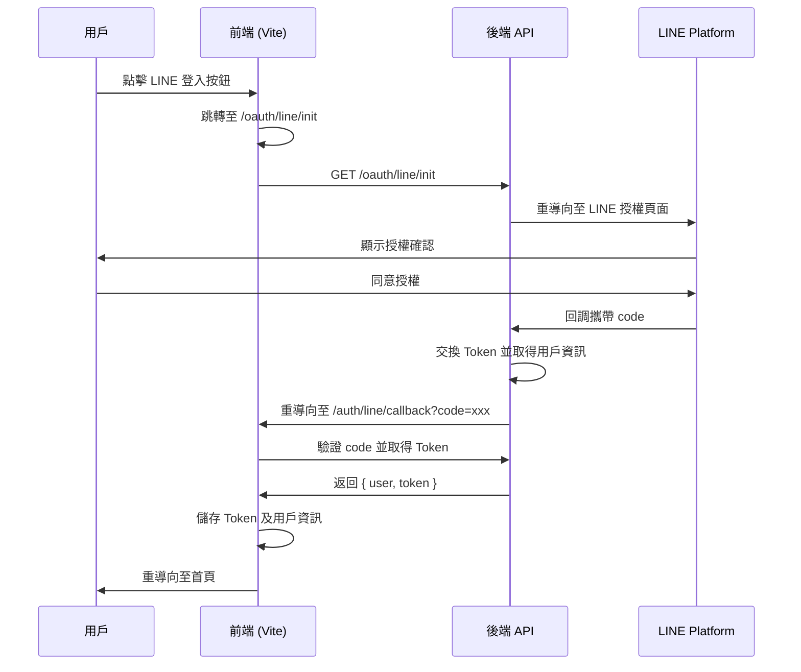

# LINE API 整合與認證保護計畫

本計畫描述如何整合後端 LINE API（`https://api.fufood.jocelynh.me/`）實現 LINE 登入、用戶資訊獲取、Navbar 連結及未登入跳轉功能。

---

## 後端 API 分析

根據後端 API 分析，確認以下端點：

| 端點 | 方法 | 說明 |
|------|------|------|
| `/oauth/line/init` | GET | LINE 登入入口，重導向至 LINE 授權頁面 |
| `/oauth/line/callback` | GET | LINE 授權回調，接收 code 並回傳用戶資訊及 Token |

> [!NOTE]
> 後端 API 基礎網址為 `https://api.fufood.jocelynh.me`，LINE 登入流程由後端處理 OAuth，前端只需重導向並處理回調。

---

## 使用者審查事項

> [!IMPORTANT]
> **需要確認的問題：**
> 1. 回調 URL 應設為何處？建議 `https://your-frontend-domain.com/auth/line/callback`
> 2. 後端回調返回的資料格式需確認（目前假設為 `{ user, token }` 格式）
> 3. LINE 用戶資訊是否包含 `lineId`、`displayName`、`pictureUrl` 欄位？

---

## 預計變更

### 環境變數配置

#### [MODIFY] [.env](file:///d:/User/Ricky/HexSchool/finalProject/fufood/.env)
新增以下環境變數：

```env
VITE_LINE_API_BASE_URL=https://api.fufood.jocelynh.me
VITE_LINE_CALLBACK_URL=http://localhost:5173/auth/line/callback
```

---

### 型別定義

#### [MODIFY] [auth.types.ts](file:///d:/User/Ricky/HexSchool/finalProject/fufood/src/modules/auth/types/auth.types.ts)
擴充 `User` 型別以支援 LINE 用戶資訊：

```typescript
export type User = {
  id: string;
  email?: string;       // LINE 登入可能無 email
  name?: string;
  avatar: string;
  createdAt: Date;
  // LINE 專屬欄位
  lineId?: string;
  displayName?: string;
  pictureUrl?: string;
};

export type LineLoginCallbackResponse = {
  user: User;
  token: AuthToken;
};
```

---

### API 層

#### [MODIFY] [authApi.ts](file:///d:/User/Ricky/HexSchool/finalProject/fufood/src/modules/auth/api/authApi.ts)
更新 LINE 登入相關 API：

```typescript
// LINE API 基礎網址
const LINE_API_BASE = import.meta.env.VITE_LINE_API_BASE_URL || 'https://api.fufood.jocelynh.me';

export const authApi = {
  // ... 現有方法 ...

  /**
   * 取得 LINE 登入 URL
   * 直接使用後端提供的 OAuth 入口
   */
  getLineLoginUrl: (): string => {
    return `${LINE_API_BASE}/oauth/line/init`;
  },

  /**
   * LINE 登入 Callback 處理
   * 處理後端回調帶回的認證資訊
   */
  handleLineCallback: async (code: string, state?: string): Promise<LineLoginCallbackResponse> => {
    if (USE_MOCK) {
      await new Promise((resolve) => setTimeout(resolve, 800));
      return {
        user: {
          ...MOCK_USERS[0],
          lineId: 'U1234567890',
          displayName: 'LINE 用戶',
          pictureUrl: 'https://example.com/avatar.jpg',
        },
        token: MOCK_TOKEN,
      };
    }
    // 實際 API 呼叫
    return apiClient.get<LineLoginCallbackResponse>(`${LINE_API_BASE}/oauth/line/callback`, { 
      code,
      state 
    });
  },
};
```

---

### 路由配置

#### [MODIFY] [routes/index.tsx](file:///d:/User/Ricky/HexSchool/finalProject/fufood/src/routes/index.tsx)
新增 LINE 回調路由：

```typescript
import LineLoginCallback from './Auth/LineLoginCallback';

// 在 auth 子路由中新增
{ path: 'line/callback', element: <LineLoginCallback /> },
```

#### [NEW] [LineLoginCallback.tsx](file:///d:/User/Ricky/HexSchool/finalProject/fufood/src/routes/Auth/LineLoginCallback.tsx)
處理 LINE 登入回調：

```typescript
import { useEffect, useState } from 'react';
import { useNavigate, useSearchParams } from 'react-router-dom';
import { useAuth } from '@/modules/auth';

const LineLoginCallback = () => {
  const navigate = useNavigate();
  const [searchParams] = useSearchParams();
  const { handleLineLogin, isLoading } = useAuth();
  const [error, setError] = useState<string | null>(null);

  useEffect(() => {
    const processCallback = async () => {
      const code = searchParams.get('code');
      const state = searchParams.get('state');
      const errorParam = searchParams.get('error');

      if (errorParam) {
        setError('LINE 登入被取消或發生錯誤');
        setTimeout(() => navigate('/auth/login'), 2000);
        return;
      }

      if (!code) {
        setError('無效的回調參數');
        setTimeout(() => navigate('/auth/login'), 2000);
        return;
      }

      try {
        await handleLineLogin(code, state);
        navigate('/');
      } catch (err) {
        setError('LINE 登入失敗，請稍後再試');
        setTimeout(() => navigate('/auth/login'), 2000);
      }
    };

    processCallback();
  }, [searchParams, handleLineLogin, navigate]);

  return (
    <div className="flex flex-col items-center justify-center h-screen bg-white">
      {error ? (
        <div className="text-red-500 text-center">
          <p>{error}</p>
          <p className="text-sm text-stone-400 mt-2">正在返回登入頁面...</p>
        </div>
      ) : (
        <div className="text-center">
          <div className="animate-spin w-8 h-8 border-4 border-[#EE5D50] border-t-transparent rounded-full mx-auto mb-4" />
          <p className="text-stone-600">正在處理 LINE 登入...</p>
        </div>
      )}
    </div>
  );
};

export default LineLoginCallback;
```

---

### Hooks

#### [MODIFY] [useAuth.ts](file:///d:/User/Ricky/HexSchool/finalProject/fufood/src/modules/auth/hooks/useAuth.ts)
新增 LINE 登入處理方法：

```typescript
import { authApi } from '../api';

export const useAuth = () => {
  // ... 現有狀態 ...

  /**
   * 處理 LINE 登入回調
   */
  const handleLineLogin = useCallback(async (code: string, state?: string) => {
    setIsLoading(true);
    setError(null);
    try {
      const response = await authApi.handleLineCallback(code, state);
      authService.saveToken(response.token);
      authService.saveUser(response.user);
      setUser(response.user);
      return response;
    } catch (err) {
      const message = err instanceof Error ? err.message : 'LINE 登入失敗';
      setError(message);
      throw err;
    } finally {
      setIsLoading(false);
    }
  }, []);

  /**
   * 取得 LINE 登入 URL
   */
  const getLineLoginUrl = useCallback(() => {
    return authApi.getLineLoginUrl();
  }, []);

  return {
    // ... 現有返回值 ...
    handleLineLogin,
    getLineLoginUrl,
  };
};
```

---

### 登入頁面

#### [MODIFY] [Login.tsx](file:///d:/User/Ricky/HexSchool/finalProject/fufood/src/routes/Auth/Login.tsx)
更新 LINE 登入按鈕實現真實跳轉：

```typescript
const handleLineLogin = () => {
  // 直接跳轉至後端 LINE OAuth 入口
  const loginUrl = getLineLoginUrl();
  window.location.href = loginUrl;
};
```

---

### TopNav 用戶資訊連結

#### [MODIFY] [TopNav.tsx](file:///d:/User/Ricky/HexSchool/finalProject/fufood/src/shared/components/layout/TopNav.tsx)
整合真實用戶資訊：

```typescript
import { useAuth } from '@/modules/auth';

const TopNav = () => {
  const { user, isAuthenticated } = useAuth();
  
  // 取得用戶頭像（優先使用 LINE 頭像）
  const userAvatar = user?.pictureUrl || user?.avatar || zoeImg;
  const userName = user?.displayName || user?.name || '使用者';

  // ... 現有程式碼 ...

  return (
    <>
      <div className="top-nav-wrapper ...">
        {/* ... */}
        
        {/* 用戶資訊區塊 - 使用真實資料 */}
        <div className="flex items-center gap-3 mb-4 pb-4 border-b border-stone-100">
          <div className="w-10 h-10 rounded-full bg-red-200 overflow-hidden">
            {user?.pictureUrl ? (
              
            ) : (
              <div className={user?.avatar || 'bg-red-200'} />
            )}
          </div>
          <div className="flex flex-col">
            <span className="text-sm font-medium text-stone-800">
              {userName} (你)
            </span>
            <span className="text-xs text-stone-400">擁有者</span>
          </div>
        </div>

        {/* 右側用戶頭像 */}
        <div className="w-8 h-8 rounded-full overflow-hidden border border-gray-200">
          {user?.pictureUrl ? (
            
          ) : (
            
          )}
        </div>
      </div>
    </>
  );
};
```

---

### 路由保護增強

#### [MODIFY] [routes/index.tsx](file:///d:/User/Ricky/HexSchool/finalProject/fufood/src/routes/index.tsx)
增強 `ProtectedRoute` 組件：

```typescript
import { Navigate, useLocation } from 'react-router-dom';

const ProtectedRoute = ({ children }: { children: React.ReactNode }) => {
  const location = useLocation();
  const token = localStorage.getItem('accessToken');
  
  if (!token) {
    // 保存原始路徑以便登入後重導向
    return <Navigate to="/auth/login" state={{ from: location }} replace />;
  }
  
  return children;
};

// 確保所有需要保護的路由都包裹 ProtectedRoute
```

---

## 資料流程圖



---

## 驗證計畫

### 手動驗證

1. **LINE 登入流程**
   - 開啟 `http://localhost:5173/auth/login`
   - 點擊「使用 LINE 應用程式登入」
   - 確認跳轉至 LINE 授權頁面
   - 完成授權後確認回到應用並自動登入

2. **用戶資訊顯示**
   - 登入成功後檢查 TopNav
   - 確認顯示 LINE 用戶名稱及頭像
   - 確認下拉選單中的用戶資訊正確

3. **未登入保護**
   - 清除 localStorage 中的 accessToken
   - 嘗試訪問 `http://localhost:5173/`
   - 確認自動跳轉至登入頁面

4. **錯誤處理**
   - 在 LINE 授權頁面取消授權
   - 確認顯示錯誤訊息並返回登入頁面

### 開發環境測試

```bash
# 啟動開發伺服器
npm run dev

# 確認環境變數設定
# 在 .env 中設定 VITE_USE_MOCK_API=false 以測試真實 API
```

---

## 注意事項

> [!WARNING]
> 1. **CORS 設定**：確保後端 API 已允許前端域名的跨域請求
> 2. **HTTPS**：生產環境必須使用 HTTPS 以符合 LINE 安全要求
> 3. **回調 URL**：需在 LINE Developers Console 中正確設定回調 URL

> [!CAUTION]
> Token 目前儲存於 localStorage，建議未來遷移至 HttpOnly Cookie（參見 [httponly-cookie-migration.md](file:///d:/User/Ricky/HexSchool/finalProject/fufood/docs/features/httponly-cookie-migration.md)）
