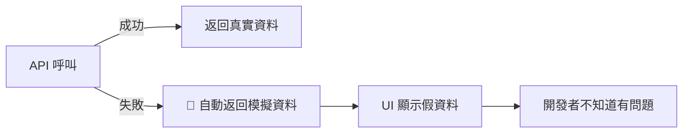
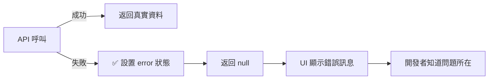
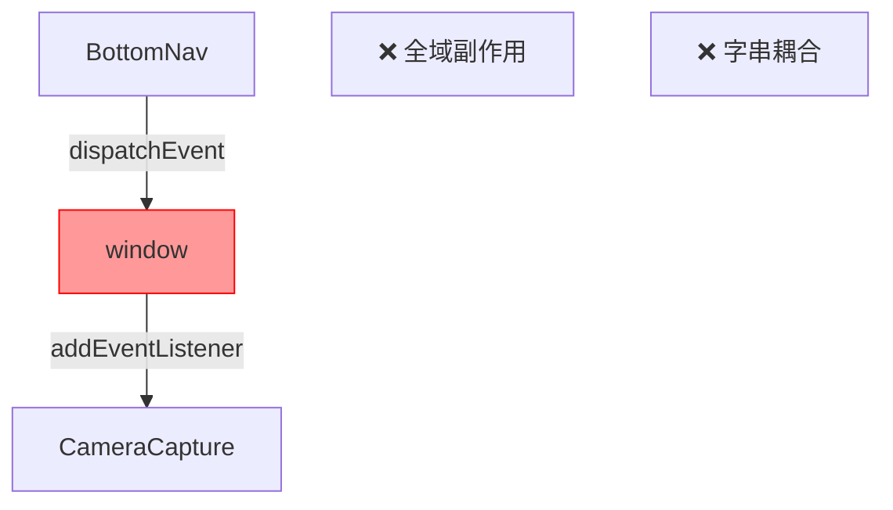
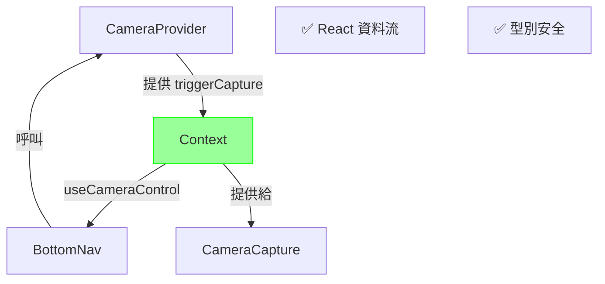

# Code Review 反饋修改規劃

## 概述

本文件針對 code review 提出的兩項反饋進行分析與修改規劃。

---

## 問題 1: API 錯誤時回退到模擬資料

### 📍 位置
[`src/modules/food-scan/hooks/useImageUpload.ts`](file:///d:/Work/Course/HexSchool/fufood/src/modules/food-scan/hooks/useImageUpload.ts#L72-L88)

### ⚠️ 問題描述

**Reviewer 反饋:**
> 目前 API 分析錯誤的 catch 區塊會回退到返回模擬資料。這在開發過程中可能會產生誤導，因為它隱藏了真實的 API 失敗。foodScanApi 服務層已經透過 VITE_USE_MOCK_API 環境變數處理了模擬和真實 API 的區別。更好的做法是將錯誤傳播到 UI，讓開發者意識到問題。此 hook 已經有一個 error 狀態可以用於此目的。此外，在 catch 區塊中動態導入模擬資料會不必要地增加生產環境的 bundle 大小。

**目前程式碼:**

```typescript
// Line 72-88
try {
  const analyzeResult = await foodScanApi.recognizeImage(optimizedUrl);
  return analyzeResult;
} catch (error) {
  console.error('API Analyze Error:', error);
  // ❌ 問題：API 失敗時回退到模擬資料
  const { MOCK_SCAN_RESULTS } = await import('../services/mock/mockData');
  const mockResult = MOCK_SCAN_RESULTS[Math.floor(Math.random() * MOCK_SCAN_RESULTS.length)];
  
  return {
    success: true,
    data: mockResult,
    timestamp: new Date().toISOString()
  };
} finally {
  setIsAnalyzing(false);
}
```

### 🔍 問題分析

#### 1. 隱藏真實錯誤
- API 失敗時自動返回模擬資料，開發者無法察覺真正的問題
- 生產環境中可能導致靜默失敗，使用者看到假資料卻不知道

#### 2. 不必要的程式碼分割
- 動態 import 會在 production bundle 中包含模擬資料程式碼
- 增加不必要的 bundle 大小（模擬資料應該只存在於開發環境）

#### 3. 職責混淆
- `foodScanApi` 服務層已經透過 `VITE_USE_MOCK_API` 處理模擬/真實 API
- Hook 層不應該再次決定是否使用模擬資料

#### 4. 錯誤狀態未使用
- Hook 已經有 `error` 狀態
- 但錯誤發生時沒有設置，UI 無法顯示錯誤訊息

### ✅ 解決方案

#### 移除回退邏輯，正確處理錯誤

```typescript
try {
  const analyzeResult = await foodScanApi.recognizeImage(optimizedUrl);
  return analyzeResult;
} catch (error) {
  console.error('API Analyze Error:', error);
  // ✅ 設置錯誤狀態，讓 UI 顯示錯誤訊息
  setError(
    error instanceof Error 
      ? error.message 
      : '圖片分析失敗，請稍後再試'
  );
  return null;
} finally {
  setIsAnalyzing(false);
}
```

### 📝 修改步驟

#### 1. 修改 `useImageUpload.ts`

**移除:**
```typescript
// Line 77-85
const { MOCK_SCAN_RESULTS } = await import('../services/mock/mockData');
const mockResult = MOCK_SCAN_RESULTS[Math.floor(Math.random() * MOCK_SCAN_RESULTS.length)];

return {
  success: true,
  data: mockResult,
  timestamp: new Date().toISOString()
};
```

**新增:**
```typescript
setError(
  error instanceof Error 
    ? error.message 
    : '圖片分析失敗，請稍後再試'
);
return null;
```

#### 2. 更新 UI 處理邏輯

**位置:** [`CameraCapture.tsx`](file:///d:/Work/Course/HexSchool/fufood/src/modules/food-scan/components/features/CameraCapture.tsx#L57-L64)

**目前:**
```typescript
const handleConfirm = async () => {
  if (img) {
    const result = await uploadImage(img);
    if (result) {
      navigate('/upload/scan-result', { state: { result: result.data, imageUrl: img } });
    }
  }
};
```

**修改為:**
```typescript
const handleConfirm = async () => {
  if (img) {
    const result = await uploadImage(img);
    if (result) {
      navigate('/upload/scan-result', { state: { result: result.data, imageUrl: img } });
    } else {
      // 顯示錯誤訊息給使用者
      // 可以透過 toast、alert 或錯誤 UI 組件
      console.error('上傳或分析失敗');
    }
  }
};
```

### 🎯 預期效果

#### Before (問題)


#### After (解決)


---

## 問題 2: 使用 window.dispatchEvent 通信

### 📍 位置
- [`src/shared/components/layout/BottomNav.tsx`](file:///d:/Work/Course/HexSchool/fufood/src/shared/components/layout/BottomNav.tsx#L166)
- [`src/modules/food-scan/components/features/CameraCapture.tsx`](file:///d:/Work/Course/HexSchool/fufood/src/modules/food-scan/components/features/CameraCapture.tsx#L26-L38)

### ⚠️ 問題描述

**Reviewer 反饋:**
> 使用 window.dispatchEvent 在 BottomNav 和 CameraCapture 之間進行通信，會產生緊密耦合，並依賴於全域副作用，這可能很脆弱且難以除錯。在 React 中，更好的方法是使用 Context 來共享狀態或回呼函式。可以考慮創建一個 CameraContext 來提供一個 capture 函式，這樣就可以從 BottomNav 直接呼叫。這將使組件之間的互動更加明確且易於維護。

**目前程式碼:**

**BottomNav.tsx (發送事件):**
```typescript
// Line 164-169
onClick={() => {
  if (isCameraMode) {
    // ❌ 使用全域事件
    window.dispatchEvent(new Event('trigger-camera-capture'));
  } else if (fabItem) {
    navigate(fabItem.href);
  }
}}
```

**CameraCapture.tsx (監聽事件):**
```typescript
// Line 26-38
React.useEffect(() => {
  const handleCaptureTrigger = () => {
    if (isCapturing) {
      handleCapture();
    }
  };

  // ❌ 全域事件監聽
  window.addEventListener('trigger-camera-capture', handleCaptureTrigger);
  return () => {
    window.removeEventListener('trigger-camera-capture', handleCaptureTrigger);
  };
}, [isCapturing, capture]);
```

### 🔍 問題分析

#### 1. 緊密耦合
- `BottomNav` 需要知道相機組件會監聽特定的事件名稱
- 事件名稱是字串，容易打錯且 TypeScript 無法檢查

#### 2. 全域副作用
- 依賴 `window` 物件，脫離 React 的資料流
- 難以追蹤資料流向，不知道誰在監聽事件

#### 3. 測試困難
- 單元測試需要模擬 window 事件
- 無法輕鬆 mock 或測試組件互動

#### 4. 可維護性差
- 如果事件名稱改變，需要同時修改兩個檔案
- 沒有型別安全

### ✅ 解決方案

使用 **React Context** 提供相機控制函式。

### 📝 修改步驟

#### 步驟 1: 建立 `CameraContext`

**新增檔案:** `src/modules/food-scan/contexts/CameraContext.tsx`

```typescript
import React, { createContext, useContext, ReactNode } from 'react';

type CameraContextType = {
  triggerCapture: () => void;
};

const CameraContext = createContext<CameraContextType | null>(null);

type CameraProviderProps = {
  children: ReactNode;
  onCapture: () => void;
};

export const CameraProvider: React.FC<CameraProviderProps> = ({ 
  children, 
  onCapture 
}) => {
  const triggerCapture = () => {
    onCapture();
  };

  return (
    <CameraContext.Provider value={{ triggerCapture }}>
      {children}
    </CameraContext.Provider>
  );
};

export const useCameraControl = () => {
  const context = useContext(CameraContext);
  if (!context) {
    throw new Error('useCameraControl must be used within CameraProvider');
  }
  return context;
};
```

#### 步驟 2: 修改 `CameraCapture.tsx`

**移除:**
```typescript
// Line 26-38 - 移除整個 useEffect
React.useEffect(() => {
  const handleCaptureTrigger = () => {
    if (isCapturing) {
      handleCapture();
    }
  };

  window.addEventListener('trigger-camera-capture', handleCaptureTrigger);
  return () => {
    window.removeEventListener('trigger-camera-capture', handleCaptureTrigger);
  };
}, [isCapturing, capture]);
```

**修改為:**
```typescript
import { CameraProvider } from '../../contexts/CameraContext';

export const CameraCapture: React.FC = () => {
  // ... 其他程式碼 ...

  return (
    <CameraProvider onCapture={handleCapture}>
      <div className="relative w-full h-full bg-black">
        {/* ... 相機 UI ... */}
      </div>
    </CameraProvider>
  );
};
```

#### 步驟 3: 修改 `BottomNav.tsx`

**新增 import:**
```typescript
import { useCameraControl } from '@/modules/food-scan/contexts/CameraContext';
```

**修改 FAB 按鈕邏輯:**
```typescript
{items.find((i) => i.isFab) && (() => {
  const fabItem = items.find((i) => i.isFab);
  const isCameraMode = location.pathname === '/upload';
  
  // ✅ 嘗試取得 camera control (如果在相機頁面)
  let cameraControl: ReturnType<typeof useCameraControl> | null = null;
  try {
    if (isCameraMode) {
      cameraControl = useCameraControl();
    }
  } catch {
    // Not in CameraProvider, it's fine
  }

  return (
    <button
      onClick={() => {
        if (isCameraMode && cameraControl) {
          // ✅ 直接呼叫 context 提供的函式
          cameraControl.triggerCapture();
        } else if (fabItem) {
          navigate(fabItem.href);
        }
      }}
      // ... 其他 props ...
    >
      {/* ... 按鈕內容 ... */}
    </button>
  );
})()}
```

> [!CAUTION]
> 上述方法在非相機頁面時會出錯。更好的做法是使用 Optional Context。

#### 步驟 3 (改進版): 使用可選的 Context

**修改 `CameraContext.tsx`:**
```typescript
export const useCameraControl = () => {
  return useContext(CameraContext); // 返回 null 如果不在 Provider 內
};
```

**修改 `BottomNav.tsx`:**
```typescript
const MobileBottomNav = ({ items = defaultNavItems }: { items?: NavItem[] }) => {
  const navigate = useNavigate();
  const location = useLocation();
  const cameraControl = useCameraControl(); // 可能是 null

  // ... 其他程式碼 ...

  return (
    <div className="fixed bottom-0 left-0 right-0 z-40">
      {/* ... */}
      
      {items.find((i) => i.isFab) && (() => {
        const fabItem = items.find((i) => i.isFab);
        const isCameraMode = location.pathname === '/upload';

        return (
          <button
            onClick={() => {
              if (isCameraMode && cameraControl) {
                // ✅ 型別安全，明確的函式呼叫
                cameraControl.triggerCapture();
              } else if (fabItem) {
                navigate(fabItem.href);
              }
            }}
            // ... 按鈕 props ...
          >
            {/* ... */}
          </button>
        );
      })()}
    </div>
  );
};
```

#### 步驟 4: 更新路由配置

確保 `CameraCapture` 在需要的地方被 `CameraProvider` 包裹。

**如果在路由層級:**

```typescript
// src/routes/Upload.tsx 或相關路由檔案
import { CameraCapture } from '@/modules/food-scan/components/features/CameraCapture';

export const UploadPage = () => {
  return <CameraCapture />;
};
```

`CameraProvid` 已經在 `CameraCapture` 內部，所以不需要額外包裹。

### 🎯 對比

#### Before (問題)
```typescript
// BottomNav.tsx
window.dispatchEvent(new Event('trigger-camera-capture')); // 字串，無型別
                                                             
// CameraCapture.tsx                                         ↓
window.addEventListener('trigger-camera-capture', handler); // 全域監聽
```

**問題:**
- ❌ 字串事件名稱，無型別檢查
- ❌ 全域副作用
- ❌ 難以追蹤資料流
- ❌ 緊密耦合

#### After (解決)
```typescript
// CameraContext.tsx
const CameraContext = createContext<{ triggerCapture: () => void }>();

// CameraCapture.tsx
<CameraProvider onCapture={handleCapture}>
  {/* ... */}
</CameraProvider>

// BottomNav.tsx
const cameraControl = useCameraControl();
cameraControl?.triggerCapture(); // 型別安全的函式呼叫
```

**優勢:**
- ✅ TypeScript 型別檢查
- ✅ 明確的資料流（Provider → Consumer）
- ✅ 易於測試（mock context）
- ✅ 解耦合

### 📊 架構圖

#### Before


#### After


---

## 實施計畫

### 優先順序

1. **高優先** - 問題 1: API 錯誤處理
   - 影響：生產環境可能靜默失敗
   - 風險：使用者看到錯誤資料
   - 工作量：小（約 15 分鐘）

2. **中優先** - 問題 2: Context 重構
   - 影響：程式碼品質與可維護性
   - 風險：無直接業務風險
   - 工作量：中（約 1 小時）

### 實施順序

#### 階段 1: 修復 API 錯誤處理（立即）

```bash
# 修改檔案
src/modules/food-scan/hooks/useImageUpload.ts
src/modules/food-scan/components/features/CameraCapture.tsx
```

**預估時間:** 15-30 分鐘

#### 階段 2: 重構為 Context 架構（後續）

```bash
# 新增檔案
src/modules/food-scan/contexts/CameraContext.tsx

# 修改檔案
src/modules/food-scan/components/features/CameraCapture.tsx
src/shared/components/layout/BottomNav.tsx
```

**預估時間:** 1-1.5 小時

### 測試計畫

#### 問題 1 測試

**測試案例 1: API 成功**
- ✅ 上傳圖片
- ✅ API 正常回應
- ✅ 導航到結果頁面

**測試案例 2: API 失敗**
- ✅ 上傳圖片
- ✅ API 回應錯誤
- ✅ 顯示錯誤訊息（不應該顯示模擬資料）

**測試案例 3: 環境變數控制**
- ✅ `VITE_USE_MOCK_API=true` 時使用模擬 API
- ✅ `VITE_USE_MOCK_API=false` 時使用真實 API

#### 問題 2 測試

**測試案例 1: 相機頁面拍照**
- ✅ 導航到 `/upload`
- ✅ 點擊 FAB 按鈕
- ✅ 觸發拍照功能

**測試案例 2: 非相機頁面**
- ✅ 在其他頁面
- ✅ 點擊 FAB 按鈕
- ✅ 導航到 `/upload`

**測試案例 3: Context 可用性**
- ✅ 在 CameraProvider 內可以使用 `useCameraControl`
- ✅ 在 CameraProvider 外返回 null

---

## 檔案清單

### 需要修改的檔案

| 檔案 | 問題 | 修改類型 |
|------|------|---------|
| [`src/modules/food-scan/hooks/useImageUpload.ts`](file:///d:/Work/Course/HexSchool/fufood/src/modules/food-scan/hooks/useImageUpload.ts) | 問題 1 | 移除回退邏輯，正確設置錯誤 |
| [`src/modules/food-scan/components/features/CameraCapture.tsx`](file:///d:/Work/Course/HexSchool/fufood/src/modules/food-scan/components/features/CameraCapture.tsx) | 問題 1, 2 | 處理錯誤、使用 Provider |
| [`src/shared/components/layout/BottomNav.tsx`](file:///d:/Work/Course/HexSchool/fufood/src/shared/components/layout/BottomNav.tsx) | 問題 2 | 使用 Context hook |

### 需要新增的檔案

| 檔案 | 問題 | 用途 |
|------|------|------|
| `src/modules/food-scan/contexts/CameraContext.tsx` | 問題 2 | 提供相機控制 Context |

---

## 風險評估

### 問題 1 修改風險

| 風險項目 | 等級 | 緩解措施 |
|---------|------|---------|
| 現有使用者體驗改變 | 🟡 中 | 需要實作錯誤 UI 組件 |
| 測試覆蓋 | 🟢 低 | 現有測試應該會失敗，易於發現 |
| 相依性影響 | 🟢 低 | 只影響單一 hook |

### 問題 2 修改風險

| 風險項目 | 等級 | 緩解措施 |
|---------|------|---------|
| 架構變更 | 🟡 中 | 充分測試相機功能 |
| 向後相容 | 🟢 低 | 新增 Context，不影響其他功能 |
| 效能影響 | 🟢 低 | Context re-render 範圍小 |

---

## 總結

### 問題 1: API 錯誤處理
- **現況:** API 失敗時自動返回模擬資料
- **問題:** 隱藏真實錯誤、增加 bundle 大小
- **解決:** 移除回退邏輯，正確設置 error 狀態
- **優勢:** 開發者可見錯誤、減少 bundle、職責清晰

### 問題 2: 組件通信
- **現況:** 使用 `window.dispatchEvent` 通信
- **問題:** 全域副作用、緊密耦合、難以測試
- **解決:** 使用 React Context 提供函式
- **優勢:** 型別安全、明確資料流、易於維護

兩個修改都將提升程式碼品質、可維護性和開發體驗。

---

*文件建立時間: 2025-11-30*  
*專案: fufood*  
*來源: Code Review 反饋*
