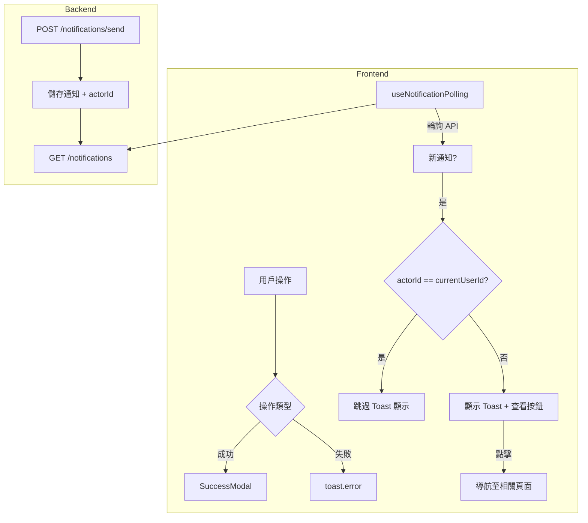

# 通知系統重構完整文件

**最後更新**：2026-01-05  
**狀態**：✅ 已完成實作

---

## 1. 系統架構概覽



---

## 2. 通知型別定義

### 2.1 通知分類 (`NotificationCategory`)
對應通知中心的三個 Tab：

| 值 | 說明 |
|:---|:---|
| `stock` | 食材管家（庫存相關） |
| `inspiration` | 靈感廚房（食譜相關） |
| `official` | 官方公告 |

### 2.2 通知類型 (`NotificationType`)
決定通知的主要分類：

| 值 | 說明 | Tab 歸屬 |
|:---|:---|:---|
| `inventory` | 庫存操作（入庫/消耗/過期） | stock |
| `shopping` | 購物清單操作 | stock |
| `group` | 群組/成員變更 | stock |
| `recipe` | 食譜相關 | inspiration |
| `system` | 系統/官方公告 | official |
| `user` | 使用者自身操作 | stock |

### 2.3 通知子類型 (`NotificationSubType`)
決定標籤樣式與顏色：

| 值 | 說明 | 標籤顏色 |
|:---|:---|:---|
| `generate` | AI 生成 | 🟡 黃色 |
| `stock` | 庫存提醒 | 🟢 綠色 |
| `consume` | 消耗操作 | 🩷 粉紅色 |
| `stockIn` | 入庫操作 | 🔴 紅色 |
| `share` | 共享邀請 | 🔵 淺藍色 |
| `list` | 清單更新 | 🔵 藍色 |
| `self` | 本人操作 | ⚪ 白色 |
| `member` | 成員變更 | ⚫ 灰色 |

### 2.4 點擊動作類型 (`NotificationActionType`)

| 值 | 說明 | 導航目標 |
|:---|:---|:---|
| `inventory` | 開啟食材詳情 | `/inventory?fridgeId={refrigeratorId}` |
| `shopping-list` | 開啟購物清單 | `/planning/list/{listId}` |
| `recipe` | 開啟食譜詳情 | `/recipes/{recipeId}` |
| `group` | 開啟群組設定 | `/settings/groups` |
| `detail` | 開啟通知詳情 | `/notifications/{id}` |

---

## 3. 前端回饋機制

### 3.1 重要操作 → SuccessModal
使用 `shared/components/ui/SuccessModal` 顯示成功狀態。

| 場景 | 文案常數 | 實際文案 |
|:---|:---|:---|
| 儲存成功 | `TOAST_MESSAGES.SUCCESS.SAVE` | 搞定！任務完成～ |
| 刪除成功 | `TOAST_MESSAGES.SUCCESS.DELETE` | 已清除！空間更清爽了 |
| 入庫成功 | `TOAST_MESSAGES.SUCCESS.STOCK_IN` | AI 辨識完成！食材已入庫 |
| 消耗成功 | `TOAST_MESSAGES.SUCCESS.CONSUME` | 消耗成功！ |
| 加入收藏 | `TOAST_MESSAGES.SUCCESS.ADD_FAVORITE` | 收入囊中！已加入收藏 |
| 取消收藏 | `TOAST_MESSAGES.SUCCESS.REMOVE_FAVORITE` | 好的～已取消收藏 |
| 發送邀請 | `TOAST_MESSAGES.SUCCESS.INVITE_SENT` | 邀請已飛出去！ |
| 建立清單 | `TOAST_MESSAGES.SUCCESS.LIST_CREATED` | 新清單誕生！ |
| 刪除清單 | `TOAST_MESSAGES.SUCCESS.LIST_DELETED` | 清單已刪除 |

### 3.2 錯誤提示 → toast.error
使用 `sonner` 的 `toast.error()` 顯示錯誤狀態。

| 場景 | 文案常數 | 實際文案 |
|:---|:---|:---|
| 通用錯誤 | `TOAST_MESSAGES.ERROR.GENERIC` | 哎呀，出了點狀況…請稍後再試 |
| 載入失敗 | `TOAST_MESSAGES.ERROR.LOAD_FAILED` | 資料讀取失敗，請重新整理頁面 |
| 儲存失敗 | `TOAST_MESSAGES.ERROR.SAVE_FAILED` | 儲存失敗，再試一次吧！ |
| 刪除失敗 | `TOAST_MESSAGES.ERROR.DELETE_FAILED` | 刪除失敗，請稍後再試 |
| 建立失敗 | `TOAST_MESSAGES.ERROR.CREATE_FAILED` | 建立失敗，請稍後再試 |
| 更新失敗 | `TOAST_MESSAGES.ERROR.UPDATE_FAILED` | 更新失敗，請稍後再試 |
| 範例食譜收藏 | `TOAST_MESSAGES.ERROR.DEMO_RECIPE` | 範例食譜無法加入收藏，試試正式生成的食譜吧！ |

### 3.3 資訊提示 → toast.info

| 場景 | 文案常數 | 實際文案 |
|:---|:---|:---|
| 複製成功 | `TOAST_MESSAGES.INFO.COPIED` | 已複製到剪貼簿！ |

---

## 4. 輪詢通知機制 (`useNotificationPolling`)

### 4.1 運作流程
1. 每 30 秒輪詢 `GET /notifications` API
2. 比對最新通知 ID，找出新通知
3. 過濾條件：
   - `isRead === false` (未讀)
   - `actorId !== currentUserId` (非本人觸發)
4. 最多同時顯示 3 個 Toast
5. Toast 顯示「**查看**」按鈕，點擊後導航至相關頁面

### 4.2 去重複邏輯
```typescript
// 過濾掉本人觸發的通知
const notificationsToShow = newNotifications.filter(
  (n) => !currentUserId || n.actorId !== currentUserId
);
```

### 4.3 導航邏輯
```typescript
switch (action.type) {
  case 'inventory':    → /inventory?fridgeId={refrigeratorId}
  case 'shopping-list': → /planning/list/{listId}
  case 'recipe':        → /recipes/{recipeId}
  case 'group':         → /settings/groups
  case 'detail':        → /notifications/{id}
  default:              → /notifications
}
```

---

## 5. 通知資料結構 (`NotificationMessage`)

```typescript
type NotificationMessage = {
  id: string;                          // 通知 UUID
  type: NotificationType;              // 主類型
  subType?: NotificationSubType;       // 子類型 (標籤)
  title: string;                       // 標題
  message: string;                     // 內文
  isRead: boolean;                     // 已讀狀態
  createdAt: string;                   // ISO 8601 時間戳
  action?: {                           // 點擊動作
    type: NotificationActionType;
    payload?: {
      refrigeratorId?: string;
      itemId?: string;
      listId?: string;
      recipeId?: string;
    };
  };
  category?: NotificationCategory;     // Tab 分類
  groupName?: string;                  // 群組名稱
  actorName?: string;                  // 操作者名稱
  actorId?: string;                    // 操作者 UID (用於去重)
};
```

---

## 6. 後端 API 需求

### 6.1 必要欄位
後端在產生通知時，必須填入 `actorId` 欄位：

```json
{
  "actorId": "firebase-uid-of-actor",
  "actorName": "小明",
  ...
}
```

### 6.2 API 端點

| 方法 | 端點 | 說明 |
|:---|:---|:---|
| GET | `/notifications` | 取得通知列表 |
| GET | `/notifications/:id` | 取得單一通知 |
| POST | `/notifications/send` | 發送通知 |
| PATCH | `/notifications/:id/read` | 標記已讀 |
| POST | `/notifications/read-all` | 全部標記已讀 |
| DELETE | `/notifications/:id` | 刪除通知 |
| POST | `/notifications/batch-delete` | 批次刪除 |
| POST | `/notifications/batch-read` | 批次標記已讀 |
| GET | `/notifications/settings` | 取得設定 |
| PATCH | `/notifications/settings` | 更新設定 |

---

## 7. 檔案清單

| 檔案 | 說明 |
|:---|:---|
| `src/constants/messages.ts` | 文案常數 |
| `src/modules/notifications/types/notification.types.ts` | 型別定義 |
| `src/modules/notifications/hooks/useNotificationPolling.ts` | 輪詢 Hook |
| `src/modules/notifications/api/notificationsApiImpl.ts` | API 實作 |
| `src/shared/components/ui/SuccessModal.tsx` | 成功 Modal |
| `docs/backend/notification_dedup_backend_guide.md` | 後端整合指南 |
