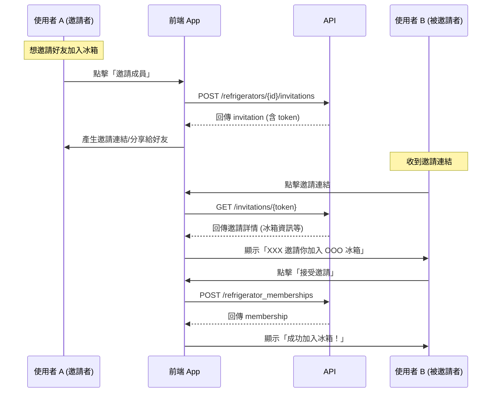

# 冰箱邀請連結 API 串接指南

> 透過連結邀請他人加入冰箱群組的完整流程

---

## 目錄

1. [流程概述](#流程概述)
2. [API 使用順序](#api-使用順序)
3. [API 詳細說明](#api-詳細說明)
4. [前端實作指南](#前端實作指南)
5. [錯誤處理](#錯誤處理)

---

## 流程概述



---

## API 使用順序

| 順序 | API | 方法 | 目的 | 呼叫者 |
|------|-----|------|------|--------|
| 1️⃣ | `/api/v1/refrigerators/{refrigeratorId}/invitations` | POST | 建立邀請連結 (產生 token) | 邀請者 |
| 2️⃣ | `/api/v1/invitations/{token}` | GET | 驗證邀請並取得資訊 | 被邀請者 |
| 3️⃣ | `/api/v1/refrigerator_memberships` | POST | 接受邀請，正式加入冰箱 | 被邀請者 |

---

## API 詳細說明

### 1. 建立邀請連結

```http
POST /api/v1/refrigerators/{refrigeratorId}/invitations
Authorization: Bearer <jwt_token>
```

**路徑參數**:

| 參數 | 類型 | 必填 | 說明 |
|------|------|------|------|
| `refrigeratorId` | uuid | ✅ | 冰箱 ID |

**回應範例** (`200`):

```json
{
  "data": {
    "id": "019b30a4-6072-7ba1-8074-753094405f5d",
    "token": "abc123xyz789",
    "refrigeratorId": "019b30a4-6072-7ba1-8074-753094405f5d",
    "invitedById": "019af809-7225-7d3b-b8f4-770e2c740e68",
    "expiresAt": "2025-12-30T08:59:19Z"
  }
}
```

---

### 2. 驗證邀請連結

```http
GET /api/v1/invitations/{token}
```

**路徑參數**:

| 參數 | 類型 | 必填 | 說明 |
|------|------|------|------|
| `token` | string | ✅ | 邀請 Token |

**回應範例** (`200`):

```json
{
  "data": {
    "id": "019b30a4-6072-7ba1-8074-753094405f5d",
    "token": "abc123xyz789",
    "refrigeratorId": "019b30a4-6072-7ba1-8074-753094405f5d",
    "refrigeratorName": "家庭冰箱",
    "invitedById": "019af809-7225-7d3b-b8f4-770e2c740e68",
    "inviterName": "小明",
    "expiresAt": "2025-12-30T08:59:19Z"
  }
}
```

**錯誤回應** (`404`):

```json
{
  "message": "邀請連結無效或已過期"
}
```

---

### 3. 接受邀請加入冰箱

```http
POST /api/v1/refrigerator_memberships
Authorization: Bearer <jwt_token>
Content-Type: application/json
```

**請求 Body**:

```json
{
  "invitationToken": "abc123xyz789"
}
```

**參數說明**:

| 欄位 | 類型 | 必填 | 說明 |
|------|------|------|------|
| `invitationToken` | string | ✅ | 邀請 Token |

**回應範例** (`200`):

```json
{
  "data": {
    "id": "019b30a4-6072-7ba1-8074-753094405f5d",
    "refrigeratorId": "019b30a4-6072-7ba1-8074-753094405f5d",
    "userId": "019af809-7225-7d3b-b8f4-770e2c740e68",
    "role": "member",
    "joinedAt": "2025-12-29T08:59:19Z"
  }
}
```

**錯誤回應** (`422`):

```json
{
  "message": "Invitation token is invalid or expired"
}
```

---

## 前端實作指南

### 步驟 1: 建立邀請連結畫面 (邀請者)

```javascript
async function createInvitation(refrigeratorId) {
  const response = await fetch(
    `/api/v1/refrigerators/${refrigeratorId}/invitations`,
    {
      method: 'POST',
      headers: { Authorization: `Bearer ${token}` }
    }
  );
  const { data: invitation } = await response.json();

  // 產生分享連結
  const shareLink = `https://yourapp.com/invite/${invitation.token}`;
  
  // 顯示分享 UI (複製連結、LINE 分享等)
  showShareDialog(shareLink);
}
```

### 步驟 2: 邀請確認頁面 (被邀請者)

```javascript
async function loadInvitation(token) {
  const response = await fetch(`/api/v1/invitations/${token}`);
  
  if (!response.ok) {
    // 邀請無效或已過期
    showError('此邀請連結無效或已過期');
    return;
  }

  const { data: invitation } = await response.json();

  // 顯示確認畫面
  showConfirmDialog({
    title: `${invitation.inviterName} 邀請你加入`,
    message: `冰箱名稱：${invitation.refrigeratorName}`
  });
}
```

### 步驟 3: 接受邀請 (被邀請者)

```javascript
async function acceptInvitation(token) {
  const response = await fetch('/api/v1/refrigerator_memberships', {
    method: 'POST',
    headers: { 
      Authorization: `Bearer ${userToken}`,
      'Content-Type': 'application/json'
    },
    body: JSON.stringify({ invitationToken: token })
  });

  if (!response.ok) {
    const error = await response.json();
    showError(error.message);
    return;
  }

  const { data: membership } = await response.json();
  
  // 成功後導向冰箱頁面
  router.push(`/refrigerators/${membership.refrigeratorId}`);
  showSuccess('成功加入冰箱！');
}
```

---

## 錯誤處理

### HTTP 狀態碼

| 狀態碼 | 說明 |
|--------|------|
| `200` | 成功 |
| `401` | 未授權，請先登入 |
| `404` | 邀請連結無效或已過期 |
| `422` | 請求參數錯誤 / 業務邏輯錯誤 |

### 常見錯誤與處理建議

| 錯誤訊息 | 原因 | 前端處理 |
|----------|------|----------|
| `邀請連結無效或已過期` | Token 錯誤或過期 | 顯示錯誤頁面，提供「返回首頁」按鈕 |
| `Invitation token is invalid or expired` | 接受邀請時 Token 已失效 | 提示使用者請邀請者重新產生連結 |
| `您已經是該冰箱的成員` | 重複加入 | 直接導向該冰箱頁面 |
| `該冰箱成員人數已達上限` | 超過人數限制 | 提示冰箱已滿 |

---

## 注意事項

> [!IMPORTANT]
> **使用者 B 必須登入**：呼叫 `POST /refrigerator_memberships` 需要 JWT Token，未登入者應先導向登入頁，登入後自動返回邀請頁面

> [!TIP]
> **Deep Link 處理**：建議在 App 啟動時檢查是否有待處理的邀請連結，可以將 token 暫存於 localStorage

> [!WARNING]
> **邀請連結可能過期**：建議在顯示邀請確認頁面時，同時顯示過期時間提醒使用者儘快加入
