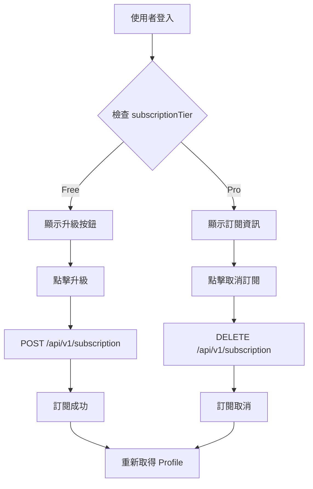

# Subscription API 使用指南

本文件描述訂閱管理相關的 API 端點，用於管理使用者的 Pro 訂閱狀態。

---

## 📋 API 總覽

| 方法   | 端點                   | 說明             | 需要認證 |
| ------ | --------------------- | ---------------- | -------- |
| POST   | `/api/v1/subscription` | 延長訂閱 (一個月) | ✅        |
| DELETE | `/api/v1/subscription` | 取消訂閱         | ✅        |

---

## 🔐 認證要求

所有 Subscription API 都需要在 Request Header 中帶入認證資訊。請確保使用者已完成登入流程。

---

## 1️⃣ 延長訂閱

### 功能說明

- 為當前使用者延長一個月的 Pro 訂閱
- 若使用者目前沒有有效訂閱，則從現在開始計算
- 若使用者目前有有效訂閱，則在到期日後延長一個月

### Request

```http
POST /api/v1/subscription
Authorization: Bearer {accessToken}
```

### Response

成功時回傳 `204 No Content`，無回傳內容。

### Response Status

| 狀態碼 | 說明                 |
| ------ | -------------------- |
| 204    | 訂閱延長成功         |
| 401    | 未授權 (未登入或 Token 過期) |

---

## 2️⃣ 取消訂閱

### 功能說明

- 立即取消當前使用者的 Pro 訂閱
- 取消後，使用者的 `subscriptionTier` 會變為 `Free`

### Request

```http
DELETE /api/v1/subscription
Authorization: Bearer {accessToken}
```

### Response

成功時回傳 `204 No Content`，無回傳內容。

### Response Status

| 狀態碼 | 說明                 |
| ------ | -------------------- |
| 204    | 訂閱取消成功         |
| 401    | 未授權 (未登入或 Token 過期) |

---

## 📊 列舉型別

### SubscriptionTier (訂閱等級)

| 值  | 名稱  | 說明          |
| --- | ----- | ------------- |
| 0   | Free  | 免費用戶      |
| 1   | Pro   | Pro 訂閱用戶  |

> [!TIP]
> 使用者的 `subscriptionTier` 是根據 `subscriptionValidUntil` 動態計算的：
> - 若 `subscriptionValidUntil` 為 `null` 或已過期 → `Free`
> - 若 `subscriptionValidUntil` 在未來 → `Pro`

---

## 💡 前端整合範例

### 延長訂閱

```javascript
const response = await fetch('/api/v1/subscription', {
  method: 'POST',
  headers: {
    'Authorization': `Bearer ${accessToken}`
  }
});

if (response.status === 204) {
  console.log('訂閱延長成功！');
  // 可呼叫 GET /api/v1/profile 取得更新後的使用者資訊
}
```

### 取消訂閱

```javascript
const response = await fetch('/api/v1/subscription', {
  method: 'DELETE',
  headers: {
    'Authorization': `Bearer ${accessToken}`
  }
});

if (response.status === 204) {
  console.log('訂閱已取消');
  // 可呼叫 GET /api/v1/profile 取得更新後的使用者資訊
}
```

### 檢查訂閱狀態

```javascript
// 透過 Profile API 取得使用者訂閱狀態
const response = await fetch('/api/v1/profile', {
  method: 'GET',
  headers: {
    'Authorization': `Bearer ${accessToken}`
  }
});

const { data: user } = await response.json();

if (user.subscriptionTier === 1) {
  console.log('Pro 用戶');
} else {
  console.log('免費用戶');
}
```

---

## ⚠️ 注意事項

1. **無 Request Body**: 這兩個 API 都不需要 Request Body
2. **立即生效**: 延長訂閱和取消訂閱都是立即生效的
3. **累加機制**: 多次呼叫 POST 會累加訂閱時間 (每次 +1 個月)
4. **取得最新狀態**: 操作完成後，建議呼叫 `GET /api/v1/profile` 取得使用者最新的訂閱資訊

---

## 🔄 訂閱流程


