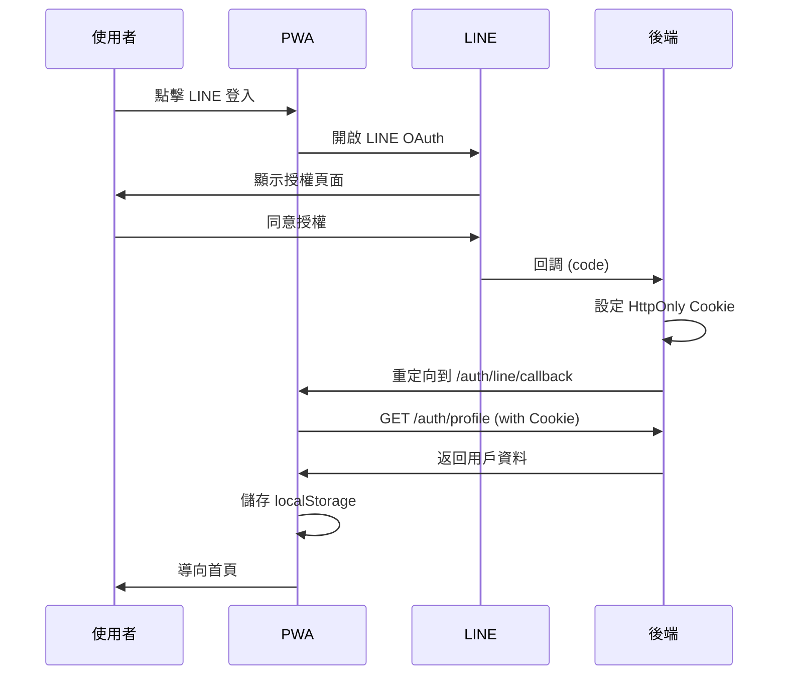
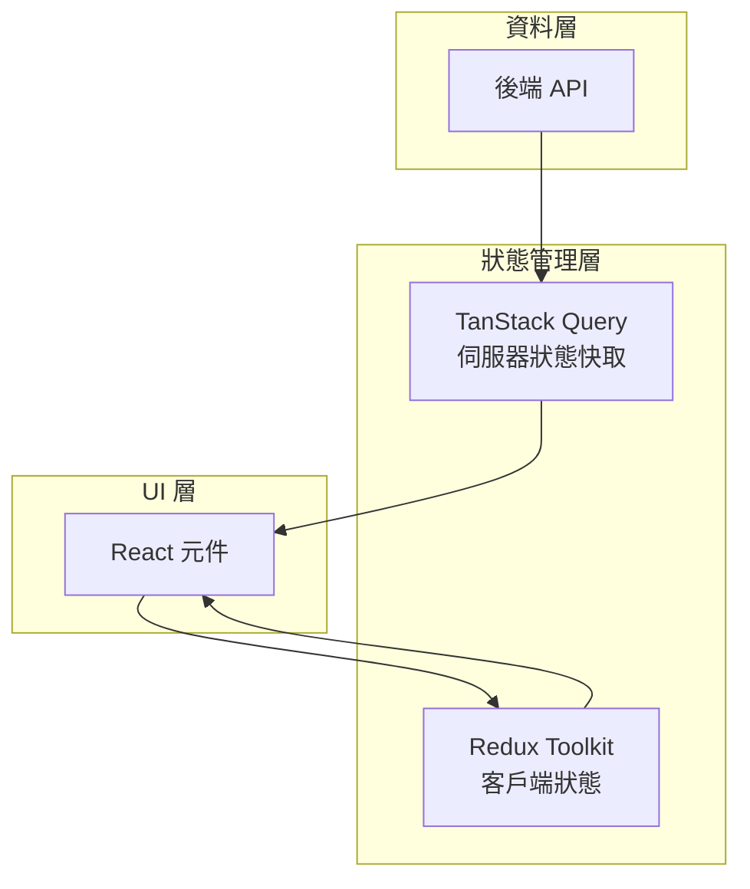

# Feature-cookie-login 分支修改說明

## 概要

此分支為 **FuFood 專案的完整功能開發分支**，從 `main` 分支分出，累計修改 **456 個檔案**，新增 **58,239 行程式碼**。主要包含專案初始化、核心模組建立、LINE OAuth 登入整合、以及完整的 PWA 食譜管理應用程式架構。

---

## 主要功能模組

### 1. 認證模組 (`src/modules/auth/`)

```
auth/
├── api/          # API 定義 (authApi.ts, queries.ts)
├── hooks/        # useAuth.ts - 認證狀態管理
├── services/     # authService.ts - Token/User 封裝
├── store/        # Redux Slice
├── types/        # 型別定義
└── utils/        # authUtils.ts - Token 工具函式
```

#### 核心功能
- **帳密登入/註冊**：傳統電子郵件登入
- **LINE OAuth 登入**：整合 LINE Login API
- **Token 管理**：
  - Access/Refresh Token 儲存與更新
  - 使用 `authUtils` 統一管理 localStorage 操作
  - 支援 HttpOnly Cookie 認證機制
- **輕量驗證**：`/auth/check` 心跳驗證端點
- **Mock 登入**：本地開發用假登入（電子郵件 + 頭像選擇）

#### API 端點
| 路由 | 說明 |
|------|------|
| `POST /api/v1/auth/login` | 帳密登入 |
| `POST /api/v1/auth/register` | 註冊 |
| `POST /api/v1/auth/logout` | 登出 |
| `POST /api/v1/auth/refresh` | 刷新 Token |
| `GET /api/v1/auth/me` | 取得使用者資訊 |
| `GET /api/v1/auth/check` | 輕量驗證 |
| `GET /api/v1/auth/line/login` | LINE OAuth 入口 |
| `GET /api/v1/auth/line/callback` | LINE OAuth 回調 |

---

### 2. LINE 登入回調 (`src/routes/Auth/LineLoginCallback.tsx`)

此元件為 LINE OAuth 回調處理頁面：

1. **後端處理**：後端透過 HttpOnly Cookie 設定 token
2. **前端驗證**：呼叫 Profile API 確認登入狀態
3. **資料儲存**：將用戶資料（id、name、avatar）存入 localStorage
4. **導航處理**：成功導向首頁，失敗則返回登入頁

#### 流程圖


---

### 3. 庫存管理模組 (`src/modules/inventory/`)

- **食材分類瀏覽**：依類別顯示庫存
- **食材卡片**：顯示過期/即將過期狀態
- **篩選器**：支援多條件篩選
- **Layout 切換**：支援網格/列表視圖

---

### 4. 食譜模組 (`src/modules/recipe/`)

- **食譜列表**：依烹飪時間分組（慢火煮、輕鬆煮、快速煮）
- **收藏功能**：支援加入收藏
- **用餐計畫**：Optimistic Update 更新
- **消耗計算**：食材消耗量計算器

---

### 5. 規劃模組 (`src/modules/planning/`)

- AI 食譜查詢
- 共享清單
- 貼文功能

---

### 6. 共用元件 (`src/shared/components/`)

| 元件 | 說明 |
|------|------|
| `TopNav` | 頂部導航列 |
| `BottomNav` | 底部導航列 |
| `HomeModal` | 首頁彈窗 |
| `InfoTooltip` | 資訊提示框 |
| `SplashScreen` | 啟動畫面 |
| `RecipeCard` | 食譜卡片 |
| `MembershipBadge` | 會員等級徽章 |

---

## TanStack Query 整合分析

### 版本資訊

```json
"@tanstack/react-query": "^5.90.12"
```

此分支採用 **TanStack Query v5**（前身為 React Query），這是目前最新的穩定版本，提供強大的資料同步與快取管理功能。

---

### 配置架構

#### 1. QueryClient 設定 (`src/lib/queryClient.ts`)

```typescript
import { QueryClient } from '@tanstack/react-query';

export const queryClient = new QueryClient();
```

目前使用**預設配置**，未設定自訂的 `defaultOptions`。可考慮未來優化：

```typescript
// 建議的進階配置
export const queryClient = new QueryClient({
  defaultOptions: {
    queries: {
      staleTime: 1000 * 60 * 5,      // 5 分鐘內資料視為新鮮
      gcTime: 1000 * 60 * 30,        // 30 分鐘後垃圾回收
      retry: 2,                       // 失敗重試 2 次
      refetchOnWindowFocus: false,   // 視窗聚焦時不自動重新取得
    },
  },
});
```

---

#### 2. Provider 架構 (`src/main.tsx`)

```tsx
import { QueryClientProvider } from '@tanstack/react-query';
import { queryClient } from '@/lib/queryClient';

createRoot(document.getElementById('root')!).render(
  <React.StrictMode>
    <Provider store={store}>           {/* Redux Store */}
      <QueryClientProvider client={queryClient}>  {/* TanStack Query */}
        <ToastProvider>
          <App />
        </ToastProvider>
      </QueryClientProvider>
    </Provider>
  </React.StrictMode>,
);
```

**架構特點**：
- `QueryClientProvider` 包覆整個應用
- 與 Redux 並行使用（雙狀態管理策略）
- 內層包含 `ToastProvider` 用於通知

---

### 實際使用案例

#### `useGetUserProfileQuery` (`src/modules/auth/api/queries.ts`)

```typescript
import { useQuery } from '@tanstack/react-query';

export const LINE_API_BASE =
  import.meta.env.VITE_LINE_API_BASE_URL || 'https://api.fufood.jocelynh.me';

export interface User {
  id: UUID;
}

export interface GetUserProfileResult {
  data: User | null;
}

// API 請求函式
export async function getUserProfile(): Promise<GetUserProfileResult> {
  const response = await fetch(`${LINE_API_BASE}/api/v1/profile`, {
    credentials: 'include',  // 攜帶 HttpOnly Cookie
  });

  if (response.status === 401) {
    return { data: null };   // 未登入返回 null
  }

  if (!response.ok) {
    throw new Error(`API 錯誤: ${response.status}`);
  }

  return response.json();
}

// TanStack Query Hook
export function useGetUserProfileQuery() {
  return useQuery({
    queryFn: getUserProfile,
    queryKey: ['GET_USER_PROFILE'],
  });
}
```

**使用場景**：
- 驗證用戶登入狀態
- 獲取用戶個人資料
- 配合 HttpOnly Cookie 進行安全認證

---

### 與 Redux 的分工策略

此專案同時使用 **Redux Toolkit** 與 **TanStack Query**，形成雙狀態管理架構：

| 職責 | 工具 | 說明 |
|------|------|------|
| **伺服器狀態** | TanStack Query | API 資料快取、同步、失效管理 |
| **客戶端狀態** | Redux Toolkit | UI 狀態、使用者偏好、全域設定 |
| **認證狀態** | 混合使用 | Redux 管理 `isAuthenticated`，Query 負責 API 驗證 |

**架構圖**：


---

### 優化計畫中的建議模式

根據 `docs/optimizations/project-optimization-plan.md`，專案計畫將更多模組遷移至 TanStack Query：

```typescript
// 建議的 Hook 模式（來自優化計畫）
// src/features/inventory/hooks/useInventory.ts
import { useQuery } from '@tanstack/react-query';
import { inventoryService } from '../services/inventoryService';

export const useInventory = () => {
  return useQuery({
    queryKey: ['inventory', 'categories'],
    queryFn: inventoryService.getCategories,
  });
};
```

**元件簡化範例**：
```tsx
export const CategoryList = () => {
  const { data: items, isLoading, error } = useInventory();

  if (isLoading) return <div>載入中...</div>;
  if (error) return <div>發生錯誤</div>;

  return (
    <div>
      {items?.map((item) => (
        <CategoryCard key={item.id} {...item} />
      ))}
    </div>
  );
};
```

---

### TanStack Query 優勢

1. **自動快取**：相同 `queryKey` 的請求自動共享快取
2. **背景更新**：資料過期時自動在背景重新取得
3. **Loading/Error 狀態**：內建狀態管理，無需手動 `useState`
4. **樂觀更新**：支援 Optimistic Updates 提升 UX
5. **DevTools**：可安裝 `@tanstack/react-query-devtools` 進行除錯

---

## 路由架構

```typescript
// src/routes/index.tsx
├── /auth
│   ├── /login          # 登入頁
│   ├── /sign-up        # 註冊頁
│   └── /line/callback  # LINE 回調
├── /dashboard          # 首頁儀表板
├── /inventory          # 庫存管理
├── /food-scan          # 食材掃描
├── /planning           # 規劃功能
├── /recipes            # 食譜列表
└── /settings           # 設定頁面
```

---

## 環境變數

| 變數 | 說明 |
|------|------|
| `VITE_USE_MOCK_API` | 是否使用 Mock API |
| `VITE_API_BASE_URL` | API 基底 URL |
| `VITE_LINE_API_BASE_URL` | LINE API 基底 URL |
| `VITE_LINE_CLIENT_ID` | LINE Login Channel ID |
| `VITE_LINE_REDIRECT_URI` | LINE Login Callback URL |

---

## 樣式架構

```
src/styles/
├── base/           # 基礎樣式 (typography)
├── components/     # 元件樣式 (buttons)
├── themes/         # 主題 (dark mode)
├── tokens/         # 設計 tokens (colors, spacing, radius)
├── utilities/      # 工具類別 (layout, camera)
└── index.css       # 主入口
```

---

## Commit 歷史重點

| Commit | 說明 |
|--------|------|
| `0ff1138` | 移除冗餘的 Content-Type header |
| `50c3541` | 登入成功後關閉 popup |
| `cb93e67` | 專案初始化 |
| `27ce90f` | 修復 lint 錯誤和 any 型別 |
| `4f53028` | 更新模組規格 |
| `42c4ef8` | 依新規格重構程式碼 |

---

## 總結

此分支是 FuFood PWA 的**完整功能開發分支**，實現了：

1. ✅ 完整的認證系統（含 LINE OAuth）
2. ✅ HttpOnly Cookie 安全認證機制
3. ✅ 模組化的程式碼架構（auth, inventory, recipe, planning）
4. ✅ **TanStack Query v5 整合**（伺服器狀態管理）
5. ✅ Redux Toolkit（客戶端狀態管理）
6. ✅ 響應式 UI 元件庫
7. ✅ PWA 最佳實踐（Service Worker, 離線支援）
8. ✅ 完善的型別定義與開發文件
