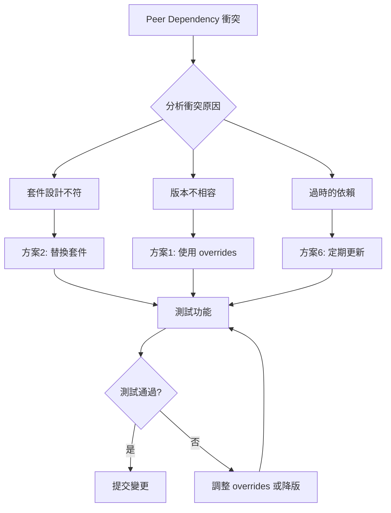

# Peer Dependency 衝突解決方案規劃

## 目錄
1. [問題分析](#問題分析)
2. [目前狀況](#目前狀況)
3. [解決方案](#解決方案)
4. [最佳實踐建議](#最佳實踐建議)
5. [實施步驟](#實施步驟)
6. [風險評估](#風險評估)

---

## 問題分析

### 什麼是 Peer Dependencies?

Peer dependencies 是指一個套件需要與另一個套件的特定版本一起使用。與普通的 dependencies 不同，peer dependencies **不會自動安裝**,而是要求專案本身提供對應版本的依賴。

### 目前專案的衝突點

根據分析,您的專案存在以下問題:

1. **next-cloudinary** - 此套件設計給 Next.js 使用,但您的專案是使用 Vite + React
2. **ESLint 相關套件** - 不同版本的 ESLint plugins 對 React 和 React Hooks 版本有不同要求
3. **React 19.x** - 較新的 React 版本,部分第三方套件可能尚未完全支援

---

## 目前狀況

### package.json 分析

```json
{
  "dependencies": {
    "react": "^19.1.1",                    // 使用最新的 React 19
    "react-dom": "^19.1.1",
    "next-cloudinary": "^6.17.5",          // ⚠️ 為 Next.js 設計
    "@radix-ui/react-*": "^1.x.x",        // UI 組件庫
    // ...
  },
  "overrides": {
    "eslint-config-airbnb": {
      "eslint-plugin-react-hooks": "^5.0.0"  // 已使用 overrides 解決部分衝突
    }
  }
}
```

### 已採用的臨時方案

- **legacy-peer-deps=true** - 忽略 peer dependency 檢查
- **overrides** - 強制覆寫特定套件版本

---

## 解決方案

除了 `legacy-peer-deps=true` 外,以下是**更完善的解決方案**:

### 方案 1: 使用 `overrides` / `resolutions` (推薦⭐⭐⭐⭐⭐)

**優點:**
- ✅ 精準控制,只覆寫有問題的套件版本
- ✅ 保留 peer dependency 檢查的安全性
- ✅ 明確記錄在 package.json 中,團隊成員可見
- ✅ 不影響其他正常的依賴關係

**缺點:**
- ⚠️ 需要清楚知道要覆寫哪些套件
- ⚠️ 可能需要手動測試相容性

**適用場景:** 
- 僅有少數特定套件版本衝突
- 團隊需要明確控制依賴版本

**實施方式:**

```json
{
  "overrides": {
    // 已有的覆寫
    "eslint-config-airbnb": {
      "eslint-plugin-react-hooks": "^5.0.0"
    },
    // 新增覆寫 - 統一 React 版本
    "react": "^19.1.1",
    "react-dom": "^19.1.1",
    // 如果有其他套件需要舊版 React,可以強制指定
    "@radix-ui/react-dialog": {
      "react": "^19.1.1",
      "react-dom": "^19.1.1"
    }
  }
}
```

---

### 方案 2: 移除/替換不相容套件 (推薦⭐⭐⭐⭐⭐)

**優點:**
- ✅ 從根本解決問題
- ✅ 避免未來的潛在 bugs
- ✅ 保持依賴樹乾淨

**缺點:**
- ⚠️ 需要找替代方案或重構程式碼
- ⚠️ 可能需要較多開發時間

**建議操作:**

#### 2.1 替換 `next-cloudinary` 

> [!IMPORTANT]
> `next-cloudinary` 是專為 Next.js 設計的套件,在 Vite + React 專案中使用會產生 peer dependency 警告。

**替代方案:**

```bash
# 移除 next-cloudinary
npm uninstall next-cloudinary

# 安裝官方 Cloudinary SDK
npm install cloudinary-core cloudinary-react
```

**程式碼重構:**

```typescript
// 原本使用 next-cloudinary
import { CldImage } from 'next-cloudinary';

// 改用 cloudinary-react
import { Image } from 'cloudinary-react';
// 或直接使用 @cloudinary/url-gen (專案已安裝)
import { Cloudinary } from '@cloudinary/url-gen';
```

---

### 方案 3: 精確版本控制 (推薦⭐⭐⭐⭐)

**優點:**
- ✅ 鎖定所有套件版本,避免自動升級導致衝突
- ✅ 確保團隊成員環境一致

**缺點:**
- ⚠️ 無法自動獲取安全性更新
- ⚠️ 需要手動管理版本升級

**實施方式:**

1. **移除版本範圍符號** (^, ~)

```json
{
  "dependencies": {
    "react": "19.1.1",           // 原本: "^19.1.1"
    "react-dom": "19.1.1",       // 原本: "^19.1.1"
    "@radix-ui/react-dialog": "1.1.15"  // 原本: "^1.1.15"
  }
}
```

2. **使用 package-lock.json**

```bash
# 確保 package-lock.json 被提交到版本控制
git add package-lock.json
git commit -m "chore: lock dependency versions"
```

---

### 方案 4: 使用 `peerDependenciesMeta` 標記為選用

**優點:**
- ✅ 告訴 npm 某些 peer dependencies 是選用的
- ✅ 減少警告訊息

**缺點:**
- ⚠️ 只適用於您自己開發的套件
- ⚠️ 無法用於第三方套件

**實施方式:**

如果您有自己的 npm package,可以在其 package.json 中加入:

```json
{
  "peerDependenciesMeta": {
    "react": {
      "optional": true
    }
  }
}
```

> [!NOTE]
> 此方案不適用於本專案,因為衝突來自第三方套件。

---

### 方案 5: 使用 `--force` 安裝 (不推薦⭐)

**優點:**
- ✅ 快速繞過錯誤

**缺點:**
- ❌ 與 `--legacy-peer-deps` 類似
- ❌ 可能導致執行時錯誤
- ❌ 隱藏潛在問題

```bash
npm install --force
```

> [!CAUTION]
> 此方案僅作為臨時應急措施,不建議長期使用。

---

### 方案 6: 定期更新依賴 (推薦⭐⭐⭐⭐)

**優點:**
- ✅ 獲取最新功能和錯誤修復
- ✅ 許多 peer dependency 問題會在新版本中解決
- ✅ 提升安全性

**缺點:**
- ⚠️ 可能引入 breaking changes
- ⚠️ 需要完整測試

**實施方式:**

```bash
# 1. 檢查過時的套件
npm outdated

# 2. 使用 npm-check-updates 檢查可更新的版本
npx npm-check-updates

# 3. 更新到最新版本
npx npm-check-updates -u

# 4. 重新安裝
npm install

# 5. 執行測試
npm run build
npm run lint
npm run test  # 如果有測試的話
```

---

## 最佳實踐建議

### 綜合解決方案 (推薦組合)

結合多種方案,達到最佳效果:



### 建議步驟:

1. **立即行動** - 替換 `next-cloudinary`
2. **短期策略** - 使用 `overrides` 鎖定版本
3. **長期維護** - 定期更新並檢查相容性

---

## 實施步驟

### 步驟 1: 替換 next-cloudinary (優先執行)

```bash
# 1. 備份目前的 package.json
cp package.json package.json.backup

# 2. 移除 next-cloudinary
npm uninstall next-cloudinary

# 3. 檢查哪些檔案使用了 next-cloudinary
# Windows PowerShell
Get-ChildItem -Path src -Recurse -Filter "*.tsx","*.ts" | Select-String "next-cloudinary"

# 4. 重構程式碼 (根據搜尋結果手動修改)

# 5. 測試應用程式
npm run dev
```

### 步驟 2: 完善 overrides 配置

在 `package.json` 中新增:

```json
{
  "overrides": {
    "eslint-config-airbnb": {
      "eslint-plugin-react-hooks": "^5.0.0"
    },
    // 新增: 統一所有套件使用 React 19
    "react": "$react",
    "react-dom": "$react-dom",
    // 確保 @radix-ui 使用正確的 React 版本
    "@radix-ui/react-dialog": {
      "@types/react": "^19.1.16",
      "@types/react-dom": "^19.1.9"
    },
    "@radix-ui/react-dropdown-menu": {
      "@types/react": "^19.1.16"
    },
    "@radix-ui/react-slot": {
      "@types/react": "^19.1.16"
    },
    "@radix-ui/react-tabs": {
      "@types/react": "^19.1.16"
    }
  }
}
```

> [!TIP]
> `$react` 語法表示使用專案根目錄定義的 react 版本

### 步驟 3: 清理並重新安裝

```bash
# 1. 刪除現有的 node_modules 和 lock file
rm -rf node_modules package-lock.json

# 2. 清除 npm cache
npm cache clean --force

# 3. 重新安裝 (不使用 legacy-peer-deps)
npm install

# 4. 檢查是否還有警告
npm ls
```

### 步驟 4: 驗證與測試

```bash
# 1. 執行 build
npm run build

# 2. 執行 lint
npm run lint

# 3. 執行開發伺服器
npm run dev

# 4. 手動測試核心功能
# - 相機拍照功能
# - 圖片上傳到 Cloudinary
# - Food Scan 功能
# - 各個頁面路由
```

---

## 風險評估

### 高風險操作

| 操作 | 風險等級 | 影響範圍 | 緩解措施 |
|------|---------|---------|---------|
| 移除 next-cloudinary | 🟡 中 | 圖片上傳功能 | 使用官方 SDK 替代,充分測試 |
| 升級所有依賴 | 🔴 高 | 整個專案 | 逐步升級,每次只更新一類套件 |
| 使用 --force | 🔴 高 | 執行時穩定性 | 避免使用 |

### 低風險操作

| 操作 | 風險等級 | 影響範圍 | 好處 |
|------|---------|---------|------|
| 使用 overrides | 🟢 低 | 依賴版本管理 | 精準控制,易於回溯 |
| 精確版本控制 | 🟢 低 | 版本鎖定 | 環境一致性提升 |
| 定期小版本更新 | 🟡 中 | 安全性與功能 | 減少技術債務 |

---

## 常見問題 FAQ

### Q1: 為什麼不能繼續使用 legacy-peer-deps?

A: **可以繼續使用**,但有以下缺點:
- 隱藏了真正的相容性問題
- 可能在執行時遇到難以除錯的錯誤
- 無法及早發現套件衝突
- 團隊成員可能不知道存在潛在問題

### Q2: overrides 和 resolutions 有什麼差別?

A:
- **overrides** - npm 7+ 支援,寫在 package.json
- **resolutions** - Yarn 專用,寫在 package.json
- 功能類似,都是強制指定依賴版本

### Q3: 如何知道哪些套件需要 override?

A: 
```bash
# 1. 查看詳細的依賴樹
npm ls --all

# 2. 查看特定套件
npm explain <package-name>

# 3. 查看 peer dependency 警告
npm install --dry-run
```

### Q4: 更新套件後如何確保沒有問題?

A:
1. 執行自動化測試 (`npm test`)
2. 執行 lint (`npm run lint`)
3. 執行 build (`npm run build`)
4. 手動測試核心功能
5. 檢查 console 是否有錯誤或警告

---

## 總結

### 推薦方案排序

針對您的專案,建議依序執行:

1. ✅ **方案 2** - 移除 `next-cloudinary`,改用 `@cloudinary/url-gen` (已安裝)
2. ✅ **方案 1** - 完善 `overrides` 配置,統一 React 版本
3. ✅ **方案 3** - 考慮精確版本控制 (可選)
4. ✅ **方案 6** - 建立定期更新機制

### 預期效果

完成後:
- ✅ 移除 `.npmrc` 中的 `legacy-peer-deps=true`
- ✅ `npm install` 不再出現 peer dependency 警告
- ✅ 依賴關係清晰透明
- ✅ 減少未來的技術債務

### 下一步行動

1. [ ] 搜尋專案中使用 `next-cloudinary` 的位置
2. [ ] 重構為使用 `@cloudinary/url-gen`
3. [ ] 更新 `package.json` 的 `overrides`
4. [ ] 清除 node_modules 重新安裝
5. [ ] 測試所有功能
6. [ ] 移除 `.npmrc` 的 `legacy-peer-deps`

---

## 參考資源

- [npm overrides 文件](https://docs.npmjs.com/cli/v9/configuring-npm/package-json#overrides)
- [Peer Dependencies 說明](https://nodejs.org/en/blog/npm/peer-dependencies)
- [Cloudinary SDK 文件](https://cloudinary.com/documentation/javascript_integration)
- [React 19 遷移指南](https://react.dev/blog/2024/04/25/react-19-upgrade-guide)

---

*文件建立時間: 2025-11-30*
*適用專案: fufood*
