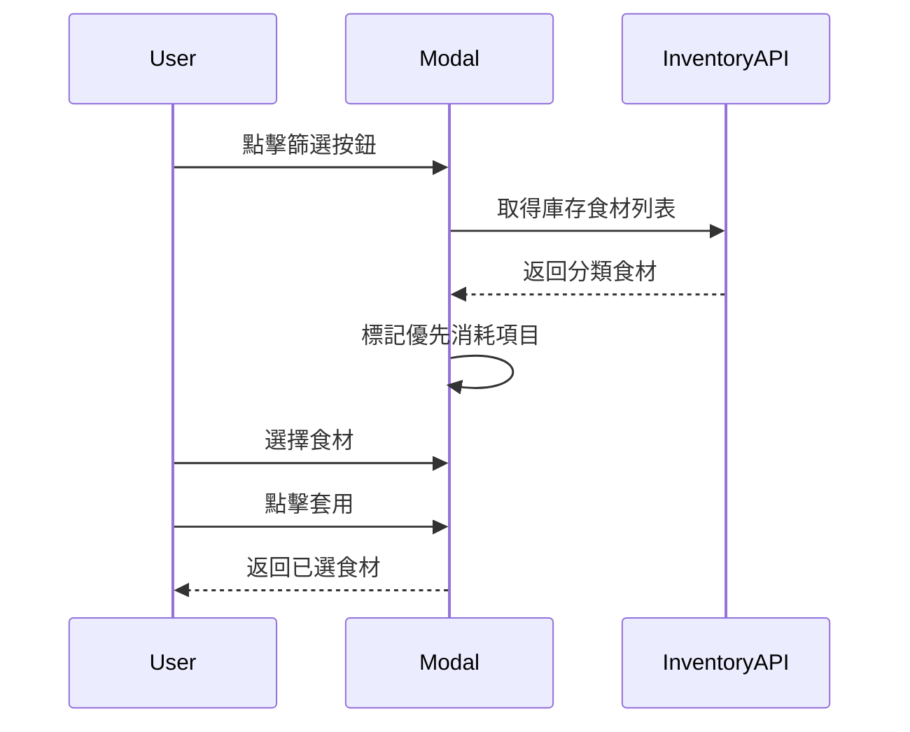
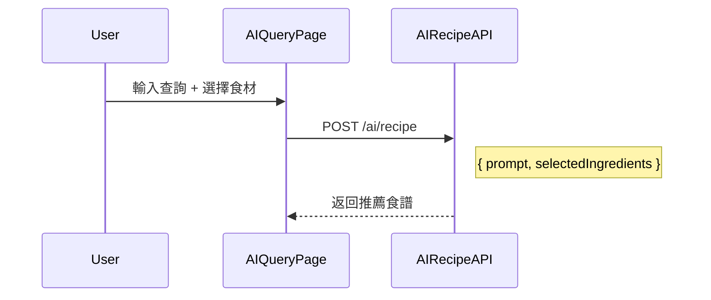

# AI 食譜頁面重構計畫

**版本**: v1.0  
**最後更新**: 2025-12-21  
**相關檔案**: `src/routes/Planning/AIQueryPage.tsx`

---

## 設計稿參考

```carousel

<!-- slide -->

<!-- slide -->

<!-- slide -->

```

---

## 需求分析

### 1. 頁面佈局調整

| 區域     | 現況                  | 設計稿                           |
| -------- | --------------------- | -------------------------------- |
| Header   | 有漸層背景            | 純白背景，「FuFood AI」標題      |
| 歡迎訊息 | 通用歡迎詞            | 個人化「{使用者名稱}，您好！」   |
| 建議標籤 | 單行按鈕              | 多行方形按鈕，可選中高亮         |
| 輸入區域 | 單一輸入框 + 送出按鈕 | 輸入框 + 篩選按鈕 + 已選食材 Tag |
| 提示文字 | 無                    | 「AI可能會出錯，請查證。」       |

### 2. 新增功能：庫存食材篩選

- **篩選按鈕**：點擊開啟庫存食材選擇 Modal
- **Modal 功能**：
  - 按分類顯示庫存食材（蔬果類、主食烘焙類等）
  - 標籤區分：「優先消耗」（紅色）、「有庫存」（黃色）
  - 最多可選 5 項食材
  - 選中項目以 primary color 顯示
  - 「清除篩選」和「套用」按鈕
- **已選食材顯示**：
  - 篩選按鈕左上角顯示已選數量
  - 已選食材以 primary color Tag 顯示在輸入框下方
  - 每個 Tag 可點擊 X 移除

---

## 技術規劃

### 使用套件 (Existing Packages)

直接使用專案現有套件，無需安裝新依賴：

- **UI & Icons**:
  - `lucide-react`: 使用 `SlidersHorizontal` (篩選圖示), `X` (關閉/移除), `Check` (選中狀態), `Plus` (加入)
  - `clsx`, `tailwind-merge`: 處理 Tag 和按鈕的動態樣式合併
  - `tailwindcss`: 核心樣式實作

- **Animations**:
  - `gsap`: 處理 Modal 的進出場動畫 (Slide up/down, Fade in/out)，與現有 `SearchModal` 保持一致

- **State & Data**:
  - `@tanstack/react-query`: 用於 `InventoryFilterModal` 獲取庫存資料 (`useQuery`)
  - `react`: 使用 `useState`, `useMemo` 管理篩選狀態

### 新增元件

#### 1. `InventoryFilterModal.tsx`

```typescript
type InventoryFilterModalProps = {
  isOpen: boolean;
  onClose: () => void;
  selectedItems: string[];
  onApply: (selectedItems: string[]) => void;
  maxSelection?: number; // 預設 5
};
```

**功能**：

- 從 API 或庫存模組取得庫存食材列表
- 按分類分組顯示
- 標記「優先消耗」（即將過期）和「有庫存」
- 支援多選（最多 maxSelection 項）
- 清除篩選和套用功能

#### 2. `SelectedIngredientTags.tsx`

```typescript
type SelectedIngredientTagsProps = {
  items: string[];
  onRemove: (item: string) => void;
};
```

**功能**：

- 以 primary color Tag 形式呈現已選食材
- 每個 Tag 右側有 X 按鈕可移除

### 修改元件

#### `AIQueryPage.tsx` 調整

1. **新增狀態**：

   ```typescript
   const [selectedIngredients, setSelectedIngredients] = useState<string[]>([]);
   const [showFilterModal, setShowFilterModal] = useState(false);
   ```

2. **修改輸入區域**：
   - 新增篩選按鈕（帶 badge 顯示已選數量）
   - 重構輸入區域佈局
   - 加入已選食材 Tag 列表

3. **API 請求調整**：
   - 將 `selectedIngredients` 加入 AI 食譜請求
   ```typescript
   await generate({
     prompt: text,
     selectedIngredients: selectedIngredients,
   });
   ```

---

## 提案修改

### AI 模組

#### [NEW] [InventoryFilterModal.tsx](file:///d:/Work/Course/HexSchool/fufood/src/modules/ai/components/InventoryFilterModal.tsx)

庫存食材篩選 Modal 元件。

#### [NEW] [SelectedIngredientTags.tsx](file:///d:/Work/Course/HexSchool/fufood/src/modules/ai/components/SelectedIngredientTags.tsx)

已選食材 Tag 列表元件。

---

### 路由頁面

#### [MODIFY] [AIQueryPage.tsx](file:///d:/Work/Course/HexSchool/fufood/src/routes/Planning/AIQueryPage.tsx)

重構頁面佈局和功能：

1. **Header 調整**：移除漸層，改為純白背景
2. **歡迎區域**：加入個人化問候
3. **建議標籤**：改為多行方形按鈕佈局
4. **輸入區域**：
   - 新增篩選按鈕
   - 新增已選食材 Tag 區域
   - 加入「加入庫存食材」提示按鈕
5. **提示文字**：新增「AI可能會出錯，請查證。」

---

## UI 細節 (Tailwind CSS)

### 建議標籤樣式

- **未選中**: `bg-white border border-neutral-200 rounded-xl px-4 py-3 text-neutral-600`
- **選中**: `bg-white border-2 border-[#F58274] rounded-xl px-4 py-3 text-[#F58274]`

### 已選食材 Tag 樣式

- **容器**: `flex items-center gap-1 px-3 py-1.5 rounded-full bg-[#FDE6E3] text-[#F58274]`
- **文字**: `text-sm font-medium`
- **移除按鈕**: `hover:bg-[#F58274]/10 rounded-full p-0.5 transition-colors`

### 篩選按鈕 Badge

- **樣式**: `absolute -top-1 -left-1 w-4 h-4 bg-[#F58274] text-white rounded-full text-[10px] flex items-center justify-center font-bold`

### 庫存食材 Modal 標籤

- **優先消耗 Badage**: `px-2 py-1 bg-yellow-400 text-neutral-900 text-xs font-bold rounded-md mb-2 inline-block`
- **有庫存 Badge**: `px-2 py-1 bg-green-500 text-white text-xs font-bold rounded-md mb-2 inline-block`
- **食材選擇按鈕**:
  - **預設**: `px-4 py-2 border rounded-full text-sm transition-colors text-neutral-600 border-neutral-200 hover:bg-gray-50`
  - **選中**: `px-4 py-2 border rounded-full text-sm transition-colors bg-[#F58274] text-white border-[#F58274]`

---

## 資料流

### 庫存食材取得



### AI 食譜生成



---

## Modal 詳細規格

### InventoryFilterModal 佈局

```
┌─────────────────────────────────────┐
│ X          庫房食材        清除篩選  │
├─────────────────────────────────────┤
│ 庫存食材                       5/5  │
│                                     │
│ 蔬果類                              │
│ [優先消耗]                          │
│ (結球甘藍) (白花椰菜) (柑橘)         │
│                                     │
│ [有庫存]                            │
│ (大陸A菜) (柑橘) (好市多香蕉) (柿子) │
│ (紅蘿蔔) [✓草莓]                    │
│                                     │
│ ─────────────────────────────────── │
│                                     │
│ 主食烘焙類                          │
│ [優先消耗]                          │
│ (美式軟餅乾) [✓檸檬塔]              │
│                                     │
│ [有庫存]                            │
│ (肉桂捲) (原味生吐司)               │
│                                     │
├─────────────────────────────────────┤
│           [     套用     ]           │
└─────────────────────────────────────┘
```

### 標籤狀態

| 狀態             | 樣式                        |
| ---------------- | --------------------------- |
| 優先消耗區塊標題 | 紅色背景 Badge              |
| 有庫存區塊標題   | 黃色背景 Badge              |
| 未選中食材       | 灰色背景圓角 Tag            |
| 已選中食材       | Primary color 背景 + ✓ 圖示 |

---

## 驗證計畫

### 功能驗證

1. **初始狀態**
   - 顯示個人化問候
   - 建議標籤正確顯示
   - 輸入區域正確佈局

2. **庫存篩選功能**
   - 點擊篩選按鈕開啟 Modal
   - 正確顯示分類食材
   - 可選擇/取消選擇食材
   - 達到上限時禁止選擇更多
   - 套用後正確返回

3. **已選食材顯示**
   - Tag 正確顯示在輸入框下方
   - 可點擊 X 移除
   - 篩選按鈕 Badge 顯示正確數量

4. **AI 生成整合**
   - 發送請求時包含 selectedIngredients
   - 結果正確顯示

---

## 實作順序

1. [ ] 建立 `InventoryFilterModal` 元件
2. [ ] 建立 `SelectedIngredientTags` 元件
3. [ ] 修改 `AIQueryPage` 佈局
4. [ ] 整合篩選功能
5. [ ] 更新 API 請求
6. [ ] 樣式調整
7. [ ] 測試驗證
