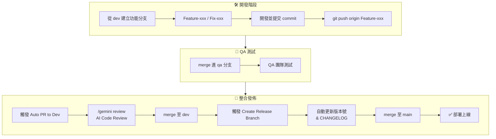

# 開發規格文件

## 🌱 Git Flow 規範

### 主分支

| 分支     | 用途     | 部署環境    |
| -------- | -------- | ----------- |
| **main** | 正式版本 | 生產環境    |
| **qa**   | 測試版本 | Vercel 預覽 |
| **dev**  | 開發整合 | 本地開發    |

### 功能分支

| 分支前綴   | 用途          | 命名範例           |
| ---------- | ------------- | ------------------ |
| `Feature-` | 新功能開發    | `Feature-ai-scan`  |
| `Fix-`     | 錯誤修正      | `Fix-login-bug`    |
| `Update-`  | 文件/設定更新 | `Update-readme`    |
| `Hotfix-`  | 緊急修正      | `Hotfix-api-error` |

---

## 📝 Commit 規範

| 前綴        | 用途             |
| ----------- | ---------------- |
| `feat:`     | 新增功能         |
| `fix:`      | 修正 bug         |
| `style:`    | 樣式調整         |
| `docs:`     | 文件更新         |
| `refactor:` | 重構程式碼       |
| `chore:`    | 設定檔、依賴更新 |
| `perf:`     | 效能優化         |
| `test:`     | 測試相關         |

**範例：**

```bash
feat: 新增 AI 多品項辨識功能
fix: 修正庫存過期計算錯誤
docs: 更新 inventory 模組 README
refactor: 重構通知模組 API 呼叫
```

---

## 📊 開發流程圖



---

## 🔄 CI/CD 流程

專案使用 GitHub Actions 進行自動化 CI/CD：

| 工作流程             | 觸發條件        | 說明                                    |
| -------------------- | --------------- | --------------------------------------- |
| `auto-pr.yml`        | Push 到功能分支 | 自動建立 PR 至目標分支                  |
| `auto-pr-select.yml` | PR 合併         | 選擇性觸發建立 PR 至目標分支            |
| `release-branch.yml` | dev 分支更新    | 建立 Release 分支並更新版本號           |
| `release-notify.yml` | 版本發布通知    | 呼叫 AI 後端 API 發布系統公告 (QA/Prod) |
| `deploy-prod.yml`    | PR 合併至 main  | 部署至生產環境                          |

---

## 🤖 Gemini Code Assist

整合 Gemini Code Assist 進行自動化 AI Code Review：

### 為什麼使用 AI Code Review？

- **節省人力**：自動化審查重複性問題，讓開發者專注於架構與邏輯討論
- **一致性**：確保每個 PR 都經過相同標準的檢查，避免遺漏
- **即時回饋**：開發者推送後立即收到改善建議，縮短迭代週期

### 實作方式

1. **GitHub App 整合**：透過 Gemini Code Assist GitHub App 連接 Repository
2. **觸發時機**：在 Auto PR 建立後，透過 PR 評論指令觸發 AI 審查
3. **審查範圍**：程式碼風格、潛在 Bug、效能建議、安全性檢查

### 使用方式

在 PR 評論中使用指令：

| 指令              | 說明             |
| ----------------- | ---------------- |
| `/gemini summary` | 產生 PR 變更摘要 |
| `/gemini review`  | 詳細程式碼審查   |
| `/gemini help`    | 查看所有指令     |

### 設定檔

專案根目錄 `.gemini-code-review.json` 定義審查規則。
