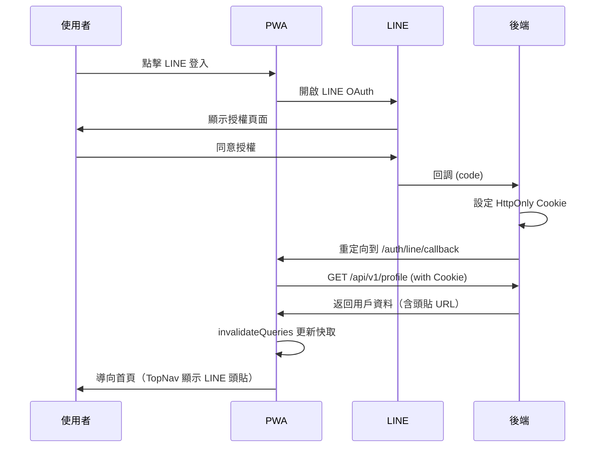

# Auth Module（使用者認證）

## 目錄

- [概要](#概要)
- [目錄結構](#目錄結構)
- [核心功能](#核心功能)
- [型別](#型別)
- [API 規格](#api-規格)
- [TanStack Query 整合](#tanstack-query-整合)
- [Hooks](#hooks)
- [Services](#services)
- [Redux Store](#redux-store)
- [環境變數](#環境變數)
- [Mock 資料](#mock-資料)

---

## 概要

負責使用者註冊、登入、登出、Token 管理、LINE OAuth，以及輕量驗證 `/auth/check`。採用 **TanStack Query** 管理伺服器狀態，**HttpOnly Cookie** 進行安全認證。

### 核心功能

1. 帳密登入與註冊
2. LINE Login OAuth（含頭貼整合）
3. HttpOnly Cookie 認證（由後端設定）
4. Access/Refresh Token 管理與更新
5. TanStack Query 資料快取與同步
6. 輕量心跳驗證 `/auth/check`
7. 取用目前使用者 `/api/v1/profile`
8. Mock 登入（電子郵件帳號 + 頭像選擇）

---

## 目錄結構

```
auth/
├── api/                  # API 層
│   ├── authApi.ts        # 傳統 API 定義（Mock 支援）
│   ├── queries.ts        # TanStack Query Hooks
│   ├── mock/             # Mock 資料
│   │   └── authMockData.ts
│   └── index.ts
├── hooks/
│   ├── useAuth.ts        # 認證 Hook（基於 TanStack Query）
│   └── index.ts
├── services/
│   ├── authService.ts    # Token / User 封裝
│   └── index.ts
├── store/
│   └── authSlice.ts      # Redux Slice
├── types/
│   ├── api.types.ts
│   ├── auth.types.ts
│   └── index.ts
├── utils/
│   └── authUtils.ts      # Token 工具函式
├── constants.ts
└── index.ts
```

---

## 型別

```typescript
export type MembershipTier = 'free' | 'premium' | 'vip';

export type User = {
  id: string;
  email?: string;           // LINE 登入可能無 email
  name?: string;
  avatar: string;
  createdAt: Date;
  // LINE 專屬欄位
  lineId?: string;
  displayName?: string;
  pictureUrl?: string;      // LINE 頭貼 URL（用於 TopNav 顯示）
  // 個人詳細資料
  phone?: string;
  gender?: 'male' | 'female' | 'other' | 'prefer-not-to-say';
  // 飲食喜好
  dietaryPreference?: DietaryPreference;
  // 會員等級
  membershipTier?: MembershipTier;
};

export type AuthToken = {
  accessToken: string;
  refreshToken?: string;
  expiresIn: number; // 秒
};

export type ProfileData = {
  id: string;
  lineId: string;
  name: string;
  profilePictureUrl: string;
};

export type ProfileResponse = {
  data: ProfileData;
};
```

---

## API 規格

### 路由（對應 API_REFERENCE_V2 #1-#9）

| 路由 | 說明 |
|------|------|
| `POST /api/v1/auth/register` | 註冊 |
| `POST /api/v1/auth/login` | 登入 |
| `POST /api/v1/auth/logout` | 登出（清除 Cookie/Session） |
| `POST /api/v1/auth/refresh` | 用 refresh token 換 access token |
| `GET /api/v1/auth/me` | 取得登入者資訊（401 視為未登入） |
| `GET /api/v1/auth/check` | 輕量驗證 Token（回 204/200 或 401） |
| `GET /oauth/line/init` | LINE OAuth 入口 |
| `GET /oauth/line/callback` | LINE OAuth 回呼 |
| `GET /api/v1/profile` | 取得當前用戶 Profile（HttpOnly Cookie 認證） |
| `PUT /api/v1/auth/update-profile` | 更新個人資料 |

### AuthApi 介面

```typescript
export const authApi = {
  login: (data: LoginRequest) => Promise<LoginResponse>;
  register: (data: RegisterRequest) => Promise<RegisterResponse>;
  logout: () => Promise<void>;
  refreshToken: (data: RefreshTokenRequest) => Promise<RefreshTokenResponse>;
  getCurrentUser: () => Promise<User>;
  checkToken: () => Promise<void>; // 204/401
  handleLineCallback: (data: LINELoginRequest) => Promise<LineLoginCallbackResponse>;
  getProfile: () => Promise<ProfileResponse>; // HttpOnly Cookie 認證
  updateProfile: (data: UpdateProfileRequest) => Promise<User>;
};
```

---

## TanStack Query 整合

### 配置

```typescript
// src/lib/queryClient.ts
import { QueryClient } from '@tanstack/react-query';

export const queryClient = new QueryClient();
```

### Provider 架構

```tsx
// src/main.tsx
<QueryClientProvider client={queryClient}>
  <App />
</QueryClientProvider>
```

### Profile Query Hook

```typescript
// src/modules/auth/api/queries.ts
export function useGetUserProfileQuery() {
  return useQuery({
    queryKey: ['GET_USER_PROFILE'],
    queryFn: getUserProfile,
    retry: false,                 // 401 時不重試
    staleTime: 1000 * 60 * 5,     // 5 分鐘內資料視為新鮮
    refetchOnWindowFocus: false,  // 視窗聚焦時不自動重新取得
    refetchOnMount: false,        // 已有快取時不自動重新取得
  });
}
```

### 登入後快取更新

```typescript
// LineLoginCallback.tsx
import { useQueryClient } from '@tanstack/react-query';

const queryClient = useQueryClient();

// 登入成功後使快取失效
await queryClient.invalidateQueries({ queryKey: ['GET_USER_PROFILE'] });
```

---

## Hooks

### `useAuth.ts`

```typescript
export const useAuth = () => {
  const query = useGetUserProfileQuery();
  const user: User | null = query.data ?? null;

  return {
    user,                        // 用戶資訊（含 LINE 頭貼 pictureUrl）
    isAuthenticated: !!user,     // 是否已登入
    isLoading: query.isLoading,  // 是否正在載入
    refetch: query.refetch,      // 手動重新取得
    error: query.error,          // 錯誤資訊
  };
};
```

**功能**：基於 TanStack Query 的認證狀態管理，提供用戶資訊與登入狀態。

---

## Services

### `authService.ts`

- 封裝 Token/User 的存取（localStorage）
- 處理 login/register/logout/refresh/check/updateProfile
- `saveUser()`：儲存用戶資料並觸發 `userUpdated` 事件
- 將 `check` 作為輕量心跳，失敗時清理本地 Token

---

## Redux Store

- `authSlice.ts` 管理 `user`, `token`, `isAuthenticated`, `isLoading`, `error`
- Actions: `loginStart/loginSuccess/loginFailure`, `logout`, `setUser`

> **注意**：目前 TanStack Query 負責伺服器狀態，Redux 負責客戶端狀態。

---

## 環境變數

| 變數 | 說明 | 範例 |
|------|------|------|
| `VITE_USE_MOCK_API` | 是否使用 Mock API | `true` / `false` |
| `VITE_API_BASE_URL` | API 基底 | `http://localhost:3000/api/v1` |
| `VITE_LINE_API_BASE_URL` | LINE API 基底 | `https://api.fufood.jocelynh.me` |
| `VITE_LINE_CLIENT_ID` | LINE Login Channel ID | `1234567890` |
| `VITE_LINE_REDIRECT_URI` | LINE Login Callback URL | `http://localhost:5173/auth/line/callback` |

---

## Mock 資料

- `authMockData.ts`：提供測試用使用者與 Token。

---

## LINE 登入流程



---

**備註**：
- `/auth/check` 保留為輕量驗證，不回傳使用者資訊
- `/api/v1/profile` 用於取得完整使用者資料（含 LINE 頭貼）
- TopNav 使用 `avatarUtils.getUserAvatarUrl()` 自動處理頭貼來源（優先使用 `pictureUrl`）
