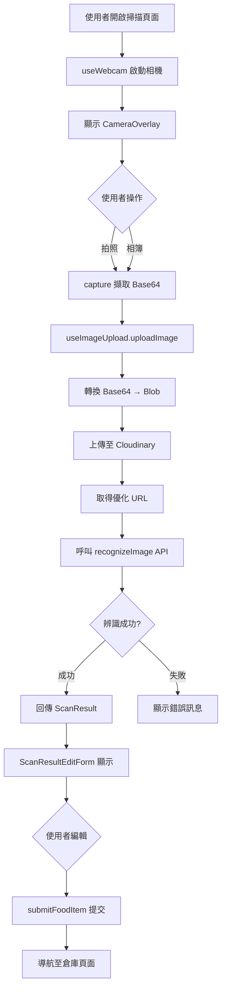

# Food Scan Module (食材掃描模組)

## 📋 目錄
- [概述](#概述)
- [目錄結構](#目錄結構)
- [核心功能](#核心功能)
- [型別定義 (Types)](#型別定義-types)
- [API 規格](#api-規格)
- [元件說明 (Components)](#元件說明-components)
- [Hooks 詳解](#hooks-詳解)
- [技術架構與流程](#技術架構與流程)
- [環境變數設定](#環境變數設定)

---

## 概述

本模組負責處理食材的**影像擷取**、**圖片上傳**、**OCR 辨識**與**結果編輯**的完整流程。整合了裝置相機、Cloudinary 圖片服務與 Google Gemini Vision API，提供使用者直覺的食材輸入與管理體驗。

### 核心功能
1. **影像擷取**: 支援即時相機預覽、拍照與相簿選取
2. **圖片上傳**: 整合 Cloudinary CDN，自動處理圖片壓縮與格式轉換
3. **OCR 辨識**: 透過 Google Gemini Vision API 分析食材影像，提取結構化資料
4. **表單編輯**: 使用 React Hook Form 處理辨識結果的編輯與驗證
5. **Mock 模式**: 支援離線開發，無需後端即可測試完整流程

---

## 目錄結構

```
food-scan/
├── components/           # UI 元件
│   ├── features/        # 功能性元件
│   │   ├── CameraCapture.tsx
│   │   ├── ScanResultEditor.tsx
│   │   └── ScanResultPreview.tsx
│   ├── forms/           # 表單元件 (React Hook Form)
│   │   ├── FormInput.tsx
│   │   ├── FormSelect.tsx
│   │   ├── FormQuantity.tsx
│   │   ├── FormDatePicker.tsx
│   │   ├── FormToggle.tsx
│   │   ├── FormTextarea.tsx
│   │   └── ScanResultEditForm.tsx
│   └── ui/              # 基礎 UI 元件
│       ├── CameraOverlay/
│       ├── InstructionsModal.tsx
│       └── ScanResultCard.tsx
├── constants/           # 常數定義
│   ├── config.ts        # 配置常數
│   └── formOptions.ts   # 表單選項
├── hooks/               # 自定義 Hooks
│   ├── useWebcam.ts
│   ├── useImageUpload.ts
│   ├── useFoodItemSubmit.ts
│   └── useScanInstructions.ts
├── services/            # API 服務層
│   ├── api/
│   │   ├── foodScanApi.ts        # API 介面定義
│   │   └── imageRecognition.ts   # 真實 API 實作
│   ├── mock/
│   │   ├── mockData.ts           # Mock 資料
│   │   └── mockFoodScanApi.ts    # Mock API 實作
│   └── index.ts                   # 服務匯出
├── store/               # Redux 狀態管理
│   └── cameraSlice.ts
├── types/               # TypeScript 型別
│   ├── foodItem.ts
│   ├── scanResult.ts
│   └── index.ts
└── utils/               # 工具函式
    ├── dateHelpers.ts
    ├── imageProcessor.ts
    └── validation.ts
```

---

## 型別定義 (Types)

### FoodItemInput
**用途**: 食材輸入資料結構，用於辨識結果與表單提交

```typescript
export type FoodItemInput = {
  productName: string;          // 產品名稱
  category: FoodCategory;       // 分類
  attributes: FoodAttribute;    // 屬性 (常溫/冷藏/冷凍)
  purchaseQuantity: number;     // 購物數量
  unit: FoodUnit;               // 單位
  purchaseDate: string;         // 購物日期 (YYYY-MM-DD)
  expiryDate: string;           // 過期日期 (YYYY-MM-DD)
  lowStockAlert: boolean;       // 低庫存提醒開關
  lowStockThreshold: number;    // 低庫存閾值
  notes: string;                // 備註
  imageUrl?: string;            // 圖片 URL (選填)
};
```

### FoodCategory (分類選項)
```typescript
export type FoodCategory = 
  | '蔬菜' 
  | '水果' 
  | '肉類' 
  | '海鮮' 
  | '乳製品' 
  | '飲品' 
  | '零食' 
  | '調味料' 
  | '其他';
```

### FoodAttribute (屬性選項)
```typescript
export type FoodAttribute = '常溫' | '冷藏' | '冷凍';
```

### FoodUnit (單位選項)
```typescript
export type FoodUnit = 
  | '個' | '包' | '瓶' | '罐' | '盒' 
  | 'kg' | 'g' | 'L' | 'ml' | '顆';
```

### ScanResult (辨識結果)
```typescript
export type ScanResult = {
  success: boolean;
  data: FoodItemInput;
  timestamp: string;  // ISO 8601 格式
};
```

### FoodItemResponse (提交回應)
```typescript
export type FoodItemResponse = {
  success: boolean;
  message: string;
  data: {
    id: string;  // 新建項目的 ID
  };
};
```

### FoodItem (完整食材資料)
```typescript
export type FoodItem = FoodItemInput & {
  id: string;
  createdAt: string;
  updatedAt?: string;
};
```

---

## API 規格

### FoodScanApi 介面

```typescript
export type FoodScanApi = {
  recognizeImage: (imageUrl: string) => Promise<ScanResult>;
  submitFoodItem: (data: FoodItemInput) => Promise<FoodItemResponse>;
  updateFoodItem: (id: string, data: Partial<FoodItemInput>) => Promise<FoodItemResponse>;
  deleteFoodItem: (id: string) => Promise<{ success: boolean }>;
  getFoodItems: (filters?: FoodItemFilters) => Promise<FoodItem[]>;
};
```

---

### 1. **recognizeImage** - 辨識食材影像

#### 端點
```
POST /api/v1/ai/analyze-image
```

#### 請求格式
```typescript
{
  imageUrl: string  // Cloudinary URL
}
```

#### 請求範例
```json
{
  "imageUrl": "https://res.cloudinary.com/demo/image/upload/v1234567890/sample.jpg"
}
```

#### 回應格式
```typescript
{
  success: boolean;
  data: {
    productName: string;
    category: FoodCategory;
    attributes: FoodAttribute;
    purchaseQuantity: number;
    unit: FoodUnit;
    purchaseDate: string;
    expiryDate: string;
    lowStockAlert: boolean;
    lowStockThreshold: number;
    notes: string;
    imageUrl?: string;
  };
  timestamp: string;
}
```

#### 回應範例
```json
{
  "success": true,
  "data": {
    "productName": "有機胡蘿蔔",
    "category": "蔬菜",
    "attributes": "冷藏",
    "purchaseQuantity": 3,
    "unit": "包",
    "purchaseDate": "2025-12-01",
    "expiryDate": "2025-12-08",
    "lowStockAlert": true,
    "lowStockThreshold": 2,
    "notes": "新鮮有機",
    "imageUrl": "https://res.cloudinary.com/..."
  },
  "timestamp": "2025-12-01T10:38:33.000Z"
}
```

#### 錯誤處理
```typescript
// HTTP 非 2xx 狀態
throw new Error(
  `影像辨識失敗：HTTP ${status} ${statusText}.\n` +
  `請求：POST ${url}\n` +
  `請確認後端可連線、已開啟 CORS 或使用 Vite 代理，並檢查 VITE_API_BASE_URL。`
);
```

---

### 2. **submitFoodItem** - 提交食材到倉庫

#### 端點
```
POST /api/v1/inventory
```

#### 請求格式
```typescript
FoodItemInput  // 完整食材資料
```

#### 請求範例
```json
{
  "productName": "有機胡蘿蔔",
  "category": "蔬菜",
  "attributes": "冷藏",
  "purchaseQuantity": 3,
  "unit": "包",
  "purchaseDate": "2025-12-01",
  "expiryDate": "2025-12-08",
  "lowStockAlert": true,
  "lowStockThreshold": 2,
  "notes": "新鮮有機",
  "imageUrl": "https://res.cloudinary.com/..."
}
```

#### 回應格式
```typescript
{
  success: boolean;
  message: string;
  data: {
    id: string;
  };
}
```

#### 回應範例
```json
{
  "success": true,
  "message": "成功歸納至倉庫",
  "data": {
    "id": "food-item-12345"
  }
}
```

---

### 3. **updateFoodItem** - 更新食材
`PUT /api/v1/inventory/{id}`

---

### 4. **deleteFoodItem** - 刪除食材
`DELETE /api/v1/inventory/{id}`

---

### 5. **getFoodItems** - 取得食材列表
`GET /api/v1/inventory`（支援 category/status 等查詢參數）

---

## 元件說明 (Components)

### 📷 features/ (功能性元件)

#### `CameraCapture.tsx`
- 相機擷取功能的容器元件
- 整合 `useWebcam` 與 `useImageUpload`
- 管理拍照與上傳流程

#### `ScanResultEditor.tsx`
- 辨識結果編輯器
- 整合 `ScanResultEditForm`
- 處理表單提交邏輯

#### `ScanResultPreview.tsx`
- 辨識結果預覽
- 唯讀顯示模式

---

### 📝 forms/ (表單元件)

所有表單元件皆整合 React Hook Form，支援驗證與錯誤顯示。

#### `FormInput.tsx`
```typescript
type FormInputProps = {
  label: string;
  name: string;
  register: UseFormRegister;
  error?: string;
  placeholder?: string;
  rules?: RegisterOptions;
  className?: string;
};
```
- 基本文字輸入欄位
- 支援自動聚焦、錯誤狀態

#### `FormSelect.tsx`
```typescript
type FormSelectProps = {
  label: string;
  name: string;
  register: UseFormRegister;
  error?: string;
  options: Array<{ value: string; label: string }>;
  rules?: RegisterOptions;
};
```
- 下拉選單
- 用於分類、屬性、單位選擇

#### `FormQuantity.tsx`
```typescript
type FormQuantityProps = {
  label: string;
  name: string;
  control: Control;
  min?: number;
  max?: number;
  className?: string;
};
```
- 數量調整元件
- 包含 +/- 按鈕與直接輸入

#### `FormDatePicker.tsx`
```typescript
type FormDatePickerProps = {
  label: string;
  name: string;
  control: Control;
  error?: string;
};
```
- 日期選擇器
- 用於購買日期與有效期限

#### `FormToggle.tsx`
```typescript
type FormToggleProps = {
  label: string;
  name: string;
  control: Control;
};
```
- 開關元件
- 用於低庫存提醒開關

#### `FormTextarea.tsx`
```typescript
type FormTextareaProps = {
  label: string;
  name: string;
  register: UseFormRegister;
  error?: string;
  placeholder?: string;
  maxLength?: number;
};
```
- 多行文字輸入
- 用於備註欄位

#### `ScanResultEditForm.tsx`
- 完整的食材編輯表單
- 整合所有 Form 元件
- 使用 React Hook Form 管理狀態
- 包含驗證邏輯

---

### 🎨 ui/ (基礎 UI 元件)

#### `CameraOverlay/index.tsx`
- 相機介面覆蓋層
- 包含掃描框、操作按鈕 (拍照、切換鏡頭、相簿)
- 視覺引導元素

#### `InstructionsModal.tsx`
- 使用說明彈窗
- 引導使用者正確拍攝食材

#### `ScanResultCard.tsx`
```typescript
type ScanResultCardProps = {
  result: FoodItemInput;
  imageUrl: string;
};
```
- 辨識結果卡片容器
- 唯讀顯示模式
- 整合成功圖示與浮動圖片

---

## Hooks 詳解

### `useWebcam.ts`
```typescript
const useWebcam = () => {
  // 回傳值
  return {
    webcamRef: RefObject<Webcam>;
    facingMode: 'user' | 'environment';
    capture: () => string | null;  // 回傳 Base64
    switchCamera: () => void;
  };
};
```
**功能**:
- 封裝 `react-webcam` 操作邏輯
- 管理相機串流生命週期
- 切換前後鏡頭
- 擷取影像 (Base64)

---

### `useImageUpload.ts`
```typescript
type UseImageUploadProps = {
  onUploadSuccess?: (blob: Blob) => Promise<void>;
};

const useImageUpload = (props?: UseImageUploadProps) => {
  return {
    isUploading: boolean;
    isAnalyzing: boolean;
    error: string | null;
    uploadImage: (img: string) => Promise<ScanResult | null>;
  };
};
```

**功能**:
- 上傳圖片至 Cloudinary
- 圖片壓縮與格式轉換 (500x500, auto format, auto quality)
- 呼叫 `foodScanApi.recognizeImage` 進行辨識
- 狀態管理: `isUploading`, `isAnalyzing`, `error`

**流程**:
1. 接收 Base64 圖片
2. 轉換為 Blob
3. 上傳至 Cloudinary
4. 產生優化 URL
5. 呼叫辨識 API
6. 回傳結果

---

### `useFoodItemSubmit.ts`
```typescript
const useFoodItemSubmit = () => {
  return {
    submitFoodItem: (data: FoodItemInput) => Promise<FoodItemResponse | null>;
    isSubmitting: boolean;
    error: string | null;
  };
};
```

**功能**:
- 提交食材至倉庫
- 呼叫 `foodScanApi.submitFoodItem`
- 錯誤處理與狀態管理

---

### `useScanInstructions.ts`
- 管理掃描說明彈窗狀態
- localStorage 記錄是否已顯示過

---

## 技術架構與流程

### 完整掃描流程圖



### Cloudinary 圖片處理

```typescript
// 圖片優化設定
myImage
  .delivery(format(auto()))          // 自動格式 (WebP/AVIF)
  .delivery(quality(auto()))         // 自動品質
  .resize(limitFit().width(500).height(500));  // 限制尺寸
```

### Mock 模式流程

當 `VITE_USE_MOCK_API=true` 時:
1. `recognizeImage` 隨機返回預設 Mock 資料 (1.5秒延遲)
2. `submitFoodItem` 存入 localStorage (1秒延遲)
3. 無需後端即可完整測試流程

---

## 環境變數設定

### 必要環境變數

```env
# Cloudinary 設定
VITE_CLOUDINARY_CLOUD_NAME=your_cloud_name
VITE_CLOUDINARY_UPLOAD_PRESET=your_upload_preset

# API 端點
VITE_API_BASE_URL=http://localhost:3000/api/v1

# Mock 模式 (開發用)
VITE_USE_MOCK_API=false
```

### 環境變數說明

| 變數名稱 | 說明 | 範例 |
|---------|------|------|
| `VITE_CLOUDINARY_CLOUD_NAME` | Cloudinary Cloud 名稱 | `demo` |
| `VITE_CLOUDINARY_UPLOAD_PRESET` | 上傳預設 | `ml_default` |
| `VITE_API_BASE_URL` | 後端 API 基礎 URL | `http://localhost:3000/api/v1` |
| `VITE_USE_MOCK_API` | 是否使用 Mock API | `true` / `false` |

---

## 表單驗證規則

| 欄位 | 規則 | 說明 |
|-----|------|------|
| `productName` | `required` | 必填 |
| `category` | `required` | 必填，限定選項 |
| `attributes` | `required` | 必填，限定選項 |
| `purchaseQuantity` | `required, min: 1` | 必填，最小值 1 |
| `unit` | `required` | 必填，限定選項 |
| `purchaseDate` | `optional` | 選填，預設今日 |
| `expiryDate` | `optional` | 選填 |
| `lowStockAlert` | - | 預設 `true` |
| `lowStockThreshold` | `min: 1` | 最小值 1 |
| `notes` | `maxLength: 200` | 最多 200 字 |

---

## 相依套件

```json
{
  "react-webcam": "^7.0.0",
  "react-hook-form": "^7.48.0",
  "@cloudinary/url-gen": "^1.12.0",
  "lucide-react": "^0.294.0"
}
```

---

## 未來優化方向

- [ ] 實作 `updateFoodItem` API
- [ ] 實作 `deleteFoodItem` API
- [ ] 實作 `getFoodItems` 與篩選功能
- [ ] 新增批次掃描功能 (一次辨識多個食材)
- [ ] 支援離線快取辨識結果
- [ ] 整合條碼掃描 (Barcode Scanner API)
- [ ] 優化圖片壓縮演算法
- [ ] 新增辨識歷史記錄
